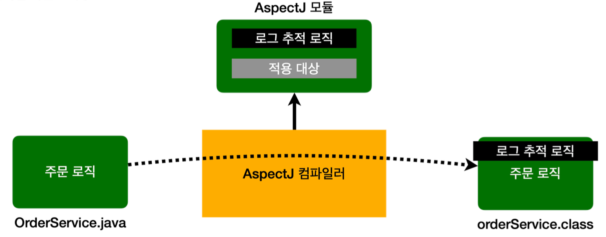
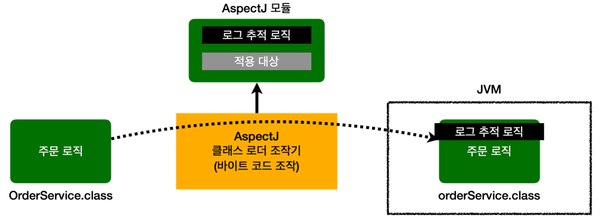

- AOP 사용 시 핵심 기능과 부가 기능이 코드상 완전히 분리되어 관리된다.
- 그렇다면 AOP를 사용할 때 부가 기능 로직은 어떤 방식으로 실제 로직에 추가될 수 있을까
- 크게 세 가지 방법이 있다
	- 컴파일 시점
	- 클래스 로딩 시점
	- 런타임 시점(프록시)

### 컴파일 시점
__컴파일 타임 - 위빙__

- `.java` 소스 컴파일러를 통해서 `.class`를 만드는 시점에 부가 기능 로직을 추가할 수 있다.
- 이때는 AspectJ가 제공하는 특별한 컴파일러를 사용해야 한다.
- 컴파일된 `.class`를 디컴파일 해보면 Aspect 관련 호출 코드가 들어간다.
- 이해하기 쉽게 풀어서 이야기하면 부가 기능 코드가 핵심 기능이 있는 컴파일된 코드 주변에 실제로 붙어서 작동된다고 생각하면 된다.
- AspectJ 컴파일러는 Aspect를 확인해서 해당 클래스가 적용 대상인지 먼저 확인 후, 적용 대상인 경우 부가 기능 로직을 적용한다.
- 참고로 이렇게 원본 로직에 부가 기능 로직이 추가되는 것을 위빙(Weaving)이라 한다.
	- 위빙(Weaving): 옷감을 짜다. 직조하다. -> 여기선, Aspect와 실제 코드를 연결해서 붙이는 것
__컴파일 시점 - 단점__
- 컴파일 시점에 부가 기능을 적용하려면 특별한 컴파일러도 필요하고, 복잡하다.

### 클래스 로딩 시점
__로드 타임 - 위빙__

- 자바를 실행하면 자바 언어는 `.class`파일을 JVM 내부의 클래스 로더에 보관
- 이때 중간에서 `.class`파일을 조작한 다음 JVM에 올릴 수 있다.
- 자바 언어는 `.class`를 JVM에 저장하기 전에 조작할 수 있는 기능을 제공한다.
	- 궁금하면 `java instrumentation`을 검색
- 참고로 수 많은 모니터링 툴들이 이 방식을 사용한다.
- 이 시점에 Apsect를 적용하는 것을 로드 타임 위빙이라 한다.

__클래스 로딩 시점 - 단점__
- 로드 타임 위빙은 자바를 실행할 때 특별한 옵션(java -javaagent)을 통해 클래스 로더 조작기를 지정해야 하는데 이 부분이 번거롭고 운영하기 어렵다.

### 런타임 시점
__런타임 - 위빙__

![런타임 시점 위빙][Pasted_image_20250611000534.png]

- 런타임 시점은 컴파일도 다 끝나고, 클래스 로더에 클래스도 다 올라가서 이미 자바가 실행되고 난 다음을 말한다.
- 자바의 메인(main) 메서드가 이미 실행된 다음.
- 따라서 자바 언어가 제공하는 범위 안에서 부가 기능을 적용해야 한다.
- Spring과 같은 컨테이너의 도움을 받고 프록시와 DI, 빈 포스트 프로세서 같은 개념들을 총 동원해야 한다.
- 이렇게 하면 최종적으로 프록시를 통해 스프링 빈에 부가 기능을 적용할 수 있다.
- 지금까지 학습한 것이 프록시 방식의 AOP다.
- 프록시를 사용하기 때문에 AOP 기능에 일부 제약은 있다.
- 하지만 특별한 컴파일러나, 자바를 실행할 때 복잡한 옵션과 클래스 로더 조작기를 설정하지 않아도 된다.
- 스프링만 있다면 AOP를 얼마든지 적용할 수 있다.

__부가 기능이 적용되는 차이를 정리하면 다음과 같다.__
- 컴파일 시점: 실제 대상 코드에 Aspect를 통한 부가 기능 호출 코드가 포함된다. AspectJ를 직접 사용해야 한다.
- 클래스 로딩 시점: 실제 대상 코드에 Aspect를 통한 부가 기능 호출 코드가 포함된다. AspectJ를 직접 사용해야 한다.
- 런타임 시점: 실제 대상 코드는 그대로 유지 된다. 대신 프록시를 통해 부가 기능이 적용된다. 따라서 항상 프록시를 통해야 부가 기능을 사용할 수 있다. (Spring AOP가 사용하는 방식)

### AOP 적용 위치
AOP는 메서드 실행 위치 뿐만 아니라 다음과 같은 다양한 위치에 적용할 수 있다.
- 적용 가능 지점(Join Point): 생성자, 필드 값 접근, static 메서드 접근, 메서드 실행
	- 이렇게 AOP를 적용할 수 있는 지점을 조인 포인트(Join Point)라 한다.
- AspectJ를 사용해서 컴파일 시점, 클래스 로딩 시점에 적용하는 AOP는 __바이트코드를 실제로 조작__ 하기 때문에 해당 기능을 모든 지점에 다 적용할 수 있다.
- 프록시 방식을 사용하는 Spring AOP는 메서드 실행 시점에만 AOP를 적용할 수 있다.
	- 프록시 방식은 메서드 오버라이딩 개념으로 동작
	- 따라서 생성자, static method, 필드 값 접근에는 프록시 개념이 적용될 수 없다.
	- 프록시를 사용하는 Spring AOP의 Join Point는 메서드 실행으로 제한된다.
- 프록시 방식을 사용하는 Spring AOP는 Spring Container가 관리할 수 있는 Spring Bean에만 AOP를 적용할 수 있다.

> 참고
> 스프링은 AspectJ의 문법을 차용하고 프록시 방식의 AOP를 적용한다. AspectJ를 직접 사용하는 것이 아니다.

> 중요
> 스프링이 제공하는 AOP는 프록시를 사용한다. 따라서 프록시를 통해 메서드를 실행하는 시점에만 AOP가 적용된다.
> AspectJ를 사용하면 앞서 설명한 것 처럼 더 복잡하고 더 다양한 기능을 사용할 수 있다.
> 그렇다면 스프링 AOP 보다는 더 기능이 많은 AspectJ를 직접 사용하는 것이 더 좋다 생각할 수 있지만, AspectJ를 사용하려면 공부할 내용도 많고, 자바 관련 설정(특별한 컴파일러, AspectJ 전용 문법, 자바 실행 옵션)도 복잡하기 때문에 별도 설정이 필요하지 않은 스프링 AOP를 사용하자.
> 실무에서는 스프링이 제공하는 AOP 기능만 사용해도 대부분의 문제를 해결할 수 있다고 한다.

__출처: 김영한 지식공유자의 스프링 핵심 원리 고급편__