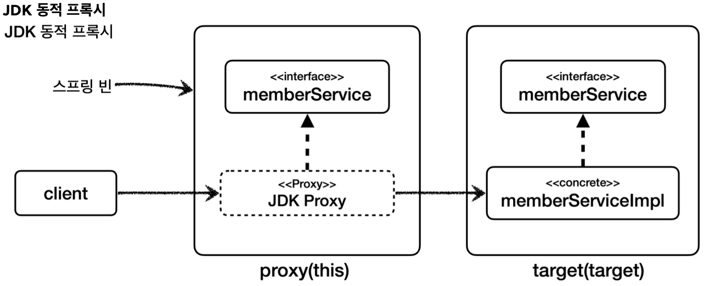
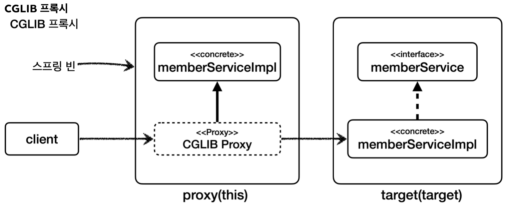

## this, target
- 정의
	- `this`: 스프링 빈 객체(스프링 AOP 프록시)를 대상으로 하는 조인 포인트
	- `target`: Target 객체(스프링 AOP 프록시가 가리키는 실제 대상)를 대상으로 하는 조인 포인트
- 설명
	- `this`, `target`은 다음과 같이 적용 타입 하나를 정확하게 지정해야 한다.
	```
	this(hello.aop.member.MemberService)
	target(hello.aop.member.MemberService)
	```
	- `*`같은 패턴을 사용할 수 없다.
	- 부모 타입을 허용한다.

### this vs target
단순히 타입 하나를 정하면 되는데, `this`와 `target`은 어떤 차이가 있을까?

스프링에서 AOP를 적용하면 실제 `target`객체 대신에 프록시 객체가 스프링 빈으로 등록된다.
- `this`는 스프링 빈으로 등록되어 있는 __프록시 객체__ 를 대상으로 포인트컷을 매칭한다.
- `target`은 실제 __target 객체__ 를 대상으로 포인트컷을 매칭한다.

### 프록시 생성 방식에 따른 차이
스프링은 프록시를 생성할 때 JDK 동적 프록시와 CGLIB를 선택할 수 있다. 
둘의 프록시를 생성하는 방식이 다르기 때문에 차이가 발생한다.

- JDK 동적 프록시: 인터페이스가 필수이고, 인터페이스를 구현한 프록시 객체를 생성한다.
- CGLIB: 인터페이스가 있어도 구체 클래스를 상속 받아서 프록시 객체를 생성한다.



먼저 JDK 동적 프록시를 적용했을 때 `this`, `target`을 알아보자.

__MemberService 인터페이스 지정__
- `this(hello.aop.member.MemberService)`
	- proxy 객체를 보고 판단한다. `this`는 부모 타입을 허용하기 때문에 AOP가 적용된다.
- `target(hello.aop.member.MemberService)`
	- target 객체를 보고 판단한다. `target`은 부모 타입을 허용하기 때문에 AOP가 적용된다.

__MemberServiceImpl 구체 클래스 지정__
- `this(hello.aop.member.MemberServiceImpl)`
	- proxy 객체를 보고 판단한다.
	- JDK 동적 프록시로 만들어진 proxy 객체는 `MemberService`인터페이스를 기반으로 구현된 새로운 클래스다.
	- 따라서 `MemberServiceImpl`를 전혀 알지 못하므로 __AOP 적용 대상이 아니다.__
- `target(hello.aop.member.MemberServiceImpl)`
	- target 객체를 보고 판단한다.
	- target 객체가 `MemberServiceImpl`타입이므로 AOP 적용 대상이다.

다음은 CGLIB 프록시 적용 시 `this`, `target`을 알아보자.



__MemberService 인터페이스 지정__
- `this(hello.aop.member.MemberService)`
	- proxy 객체를 보고 판단한다. `this`는 부모 타입을 허용하기 때문에 AOP가 적용된다.  
- `target(hello.aop.member.MemberService)`
	- target 객체를 보고 판단한다. `target` 은 부모 타입을 허용하기 때문에 AOP가 적용된다.

__MemberServiceImpl 구체 클래스 지정__
- `this(hello.aop.member.MemberServiceImpl)`
	- proxy 객체를 보고 판단한다.
	- CGLIB로 만들어진 proxy 객체는 `MemberServiceImpl`를 상속 받아서 만들었기 때문에 AOP가 적용된다.
	- `this`가 부모 타입을 허용하기 때문에 포인트컷의 대상이 된다.
- `target(hello.aop.member.MemberServiceImpl)`
	- target 객체를 보고 판단한다.
	- target 객체가 `MemberServiceImpl`타입이므로 AOP 적용 대상이다.

__정리__
프록시를 대상으로하는 `this`의 경우 구체 클래스를 지정하면 프록시 생성 전략에 따라서 다른 결과가 나올 수 있다는 점을 알아두자.

## ThisTargetTest
```java
package hello.aop.pointcut;  
  
import hello.aop.member.MemberService;  
import lombok.extern.slf4j.Slf4j;  
import org.aspectj.lang.ProceedingJoinPoint;  
import org.aspectj.lang.annotation.Around;  
import org.aspectj.lang.annotation.Aspect;  
import org.junit.jupiter.api.Test;  
import org.springframework.beans.factory.annotation.Autowired;  
import org.springframework.boot.test.context.SpringBootTest;  
import org.springframework.context.annotation.Import;  
  
/**  
 * application.properties * spring.aop.proxy-target-class=true CGLIB
 * spring.aop.proxy-target-class=false JDK 동적 프록시 
 * */
@Slf4j  
@Import(ThisTargetTest.ThisTargetAspect.class)  
@SpringBootTest(properties = "spring.aop.proxy-target-class=false") //JDK 동적 프록 시  
//@SpringBootTest(properties = "spring.aop.proxy-target-class=true") //CGLIB  
public class ThisTargetTest {  
  
  @Autowired  
  MemberService memberService;  
  
  @Test  
  void success() {  
    log.info("memberService Proxy={}", memberService.getClass());  
    memberService.hello("helloA");  
  }  
  
  @Slf4j  
  @Aspect  static class ThisTargetAspect {  
  
    //부모 타입 허용  
    @Around("this(hello.aop.member.MemberService)")  
    public Object doThisInterface(ProceedingJoinPoint joinPoint) throws Throwable {  
      log.info("[this-interface] {}", joinPoint.getSignature());  
      return joinPoint.proceed();  
    }  
  
    //부모 타입 허용  
    @Around("target(hello.aop.member.MemberService)")  
    public Object doTargetInterface(ProceedingJoinPoint joinPoint) throws Throwable {  
      log.info("[target-interface] {}", joinPoint.getSignature());  
      return joinPoint.proceed();  
    }  
  
    //this: 스프링 AOP 프록시 객체 대상  
    //JDK 동적 프록시는 인터페이스를 기반으로 생성되므로 구현 클래스를 알 수 없음    //CGLIB 프록시는 구현 클래스를 기반으로 생성되므로 구현 클래스를 알 수 있음    @Around("this(hello.aop.member.MemberServiceImpl)")  
    public Object doThis(ProceedingJoinPoint joinPoint) throws Throwable {  
      log.info("[this-impl] {}", joinPoint.getSignature());  
      return joinPoint.proceed();  
    }  
  
    //target: 실제 target 객체 대상  
    @Around("target(hello.aop.member.MemberServiceImpl)")  
    public Object doTarget(ProceedingJoinPoint joinPoint) throws Throwable {  
      log.info("[target-impl] {}", joinPoint.getSignature());  
      return joinPoint.proceed();  
    }  
  }  
    
}
```

- `properties = {"spring.aop.proxy-target-class=false"}`
	- `application.properties`에 설정하는 대신에 해당 테스트에서만 설정을 임시로 적용한다.
	- 이렇게 하면 각 테스트마다 다른 설정을 손쉽게 적용할 수 있다.  
- `spring.aop.proxy-target-class=false`
	- 스프링이 AOP 프록시를 생성할 때 JDK 동적 프록시를 우선 생성한다.
	- 물론 인터페이스가 없다면 CGLIB를 사용한다.
- `spring.aop.proxy-target-class=true`
	- 스프링이 AOP 프록시를 생성할 때 CGLIB 프록시를 생성한다.
	- 참고로 이 설정을 생략하면 스프링 부트에서 기본으로 CGLIB를 사용한다.

#### spring.aop.proxy-target-class=false
- JDK 동적 프록시 사용
```
memberService Proxy=class com.sun.proxy.$Proxy53
[target-impl] String hello.aop.member.MemberService.hello(String)
[target-interface] String hello.aop.member.MemberService.hello(String)
[this-interface] String hello.aop.member.MemberService.hello(String)
```
JDK 동적 프록시를 사용하면 `this(hello.aop.member.MemberServiceImpl)`로 지정한 `[this-impl]`부분이 출력되지 않는 것을 확인할 수 있다.

#### spring.aop.proxy-target-class=true, 또는 생략(스프링 부트 기본 옵션)
- CGLIB 사용
```
memberService Proxy=class hello.aop.member.MemberServiceImpl$$EnhancerBySpringCGLIB$$7df96bd3
[target-impl] String hello.aop.member.MemberServiceImpl.hello(String)
[target-interface] String hello.aop.member.MemberServiceImpl.hello(String)
[this-impl] String hello.aop.member.MemberServiceImpl.hello(String)
[this-interface] String hello.aop.member.MemberServiceImpl.hello(String)
```

> 참고
> `this`, `target` 지시자는 단독으로 사용되기 보다는 파라미터 바인딩에서 주로 사용된다.


__출처: 김영한 지식공유자의 스프링 핵심 원리 고급편__