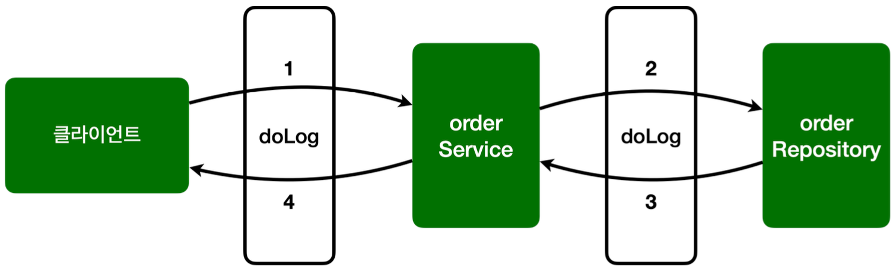

- 스프링 AOP를 구현하는 일반적인 방법은 `@Aspect`를 사용하는 방법이다.

#### AspectV1
```java
package hello.aop.order.aop;  
  
import lombok.extern.slf4j.Slf4j;  
import org.aspectj.lang.ProceedingJoinPoint;  
import org.aspectj.lang.annotation.Around;  
import org.aspectj.lang.annotation.Aspect;  
  
@Slf4j  
@Aspect  
public class AspectV1 {  
  
  @Around("execution(* hello.aop.order..*(..))")  
  public Object doLog(ProceedingJoinPoint joinPoint) throws Throwable {  
    log.info("[log] {}", joinPoint.getSignature());  
    return joinPoint.proceed();  
  }  
  
}
```

- `@Around` 애노테이션의 값인 `execution(* hello.aop.order..*(..))`는 포인트컷이 된다.
- `@Around` 애노테이션의 메서드인 `doLog`는 어드바이스(Advice)가 된다.
- `execution(* hello.aop.order..*(..))`는 `hello.aop.order` 패키지와 그 하위 패키지`(..)`를 지정하는 AspectJ의 포인트컷 표현식이다.
- 이제 `OrderService`, `OrderRepository`는 AOP 적용 대상이 된다.
	- 스프링은 프록시 방식의 AOP를 사용하므로 프록시를 통하는 메서드만 적용 대상이 된다.

> 참고: 
> 스프링 AOP는 AspectJ의 문법을 차용하고, 프록시 방식의 AOP를 제공한다. AspectJ를 직접 사용하는 것이 아니다.
> 스프링 AOP를 사용할 때는 @Aspect를 애노테이션을 주로 사용하는데, 이 애노테이션도 AspectJ가 제공하는 애노테이션이다.

> 참고: 
> `@Aspect` 를 포함한 `org.aspectj` 패키지 관련 기능은 `aspectjweaver.jar` 라이브러리가 제공하는 기능이다.
> 앞서 `build.gradle` 에 `spring-boot-starter-aop` 를 포함했는데, 이렇게 하면 스프링의 AOP 관련 기능과 함께 `aspectjweaver.jar` 도 함께 사용할 수 있게 의존 관계에 포함된다.
> 그런데 스프링에서는 AspectJ가 제공하는 애노테이션이나 관련 인터페이스만 사용하는 것이고, 실제 AspectJ 가 제공하는 컴파일, 로드타임 위버 등을 사용하는 것은 아니다.
> 스프링은 프록시 방식의 AOP를 사용한다.

#### AopTest - 추가

```java
package hello.aop;  
  
import static org.assertj.core.api.Assertions.assertThatThrownBy;  
  
import hello.aop.order.OrderRepository;  
import hello.aop.order.OrderService;  
import hello.aop.order.aop.AspectV1;  
import lombok.extern.slf4j.Slf4j;  
import org.junit.jupiter.api.Test;  
import org.springframework.aop.support.AopUtils;  
import org.springframework.beans.factory.annotation.Autowired;  
import org.springframework.boot.test.context.SpringBootTest;  
import org.springframework.context.annotation.Import;  
  
@Slf4j  
@Import(AspectV1.class)  
@SpringBootTest  
public class AopTest {  
  
  @Autowired  
  OrderService orderService;  
  
  @Autowired  
  OrderRepository orderRepository;  
  
  @Test  
  void aopInfo() {  
    log.info("is AOP Proxy, orderService = {}", AopUtils.isAopProxy(orderService));  
    log.info("is AOP Proxy, orderRepository = {}", AopUtils.isAopProxy(orderRepository));  
  }  
  
  @Test  
  void success() {  
    orderService.orderItem("itemA");  
  }  
  
  @Test  
  void exception() {  
    assertThatThrownBy(() -> orderService.orderItem("ex"))  
        .isInstanceOf(IllegalStateException.class);  
  }  
  
}
```

- `@Aspect`는 애스팩트라는 표식이지 컴포넌트 스캔의 대상이 되는 것이 아니다. 따라서 `AspectV1`을 AOP로 사용하려면 스프링 빈으로 등록해야 한다.
- 스프링 빈으로 등록하는 방법은 다음과 같다.
	- `@Bean`을 사용해서 직접 등록
	- `@Component`를 통해 컴포넌트 스캔을 사용해서 자동 등록
	- `@Import`를 통해 등록 (주로 설정 파일을 추가할 때 사용 `@Configuration`)
- `@Import`는 주로 설정 파일을 추가할 때 사용하지만, 이 기능으로 스프링 빈도 등록할 수 있다.
	- 테스트에서는 버전을 올려가면서 변경할 예정이어서 간단하게 `@Import` 기능을 사용하자.

```
// void success() 실행 결과 로그

hello.aop.order.aop.AspectV1             : [log] void hello.aop.order.OrderService.orderItem(String)
hello.aop.order.OrderService             : [orderService] 실행
hello.aop.order.aop.AspectV1             : [log] String hello.aop.order.OrderRepository.save(String)
hello.aop.order.OrderRepository          : [orderRepository 실행]
```

- 출력 결과는 위와 같이 `AspectV1`에 의해 적용된 모습을 확인할 수 있다.
- `joinPoint.getSignature()`를 통해 `void hello.aop.order.OrderService.orderItem(String)`를 확인할 수 있다.
	- `void`: 반환 값 정보
	- `hello.aop.order.OrderService.orderItem(String)`: 패키지와 클래스, 메서드 이름 및 인자 정보




```
// void aopInfo() 실행 결과 로그

hello.aop.AopTest                        : is AOP Proxy, orderService = true
hello.aop.AopTest                        : is AOP Proxy, orderRepository = true
```

- Aspect를 적용하기 전에는 Proxy가 아니었지만, 적용하니 Proxy로 감싸진 것을 확인할 수 있다.


__출처: 김영한 지식공유자의 스프링 핵심 원리 고급편__
