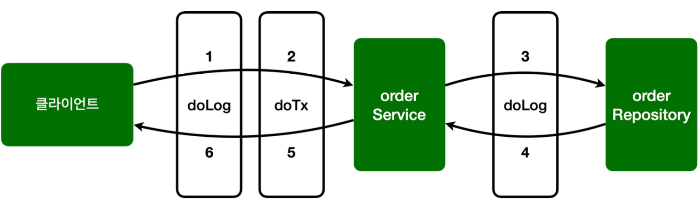

- 조금 더 복잡한 예제
	- 트랜잭션을 적용하는 코드 추가
	- 실제 트랜잭션은 아니자만, 기능이 동작하는 것 처럼 로그만 남기자.
- 트랜잭션의 기능은 보통 아래 프로세스로 동작
	- 핵심 로직 실행 직전 트랜잭션 시작
	- 핵심 로직 실행
	- 핵심 로직에 문제 없다면 커밋
	- 핵심 로직에 예외가 발생하면 롤백

__AspectV3__

```java
package hello.aop.order.aop;  
  
import lombok.extern.slf4j.Slf4j;  
import org.aspectj.lang.ProceedingJoinPoint;  
import org.aspectj.lang.annotation.Around;  
import org.aspectj.lang.annotation.Aspect;  
import org.aspectj.lang.annotation.Pointcut;  
  
@Slf4j  
@Aspect  
public class AspectV3 {  
  
  // hello.aop.order 패키지와 하위 패키지  
  @Pointcut("execution(* hello.aop.order..*(..))")  
  public void allOrder() {}  
  
  // 클래스 패턴 이름이 *Service  
  @Pointcut("execution(* *..*Service.*(..))")  
  private void allService() {}  
  
  @Around("allOrder()")  
  public Object doLog(ProceedingJoinPoint joinPoint) throws Throwable {  
    log.info("[log] {}", joinPoint.getSignature());  
    return joinPoint.proceed();  
  }  
  
  // hello.aop.order 패키지와 하위 패키지면서 클래스 이름이 *Service  
  @Around("allOrder() && allService()")
  public Object doTransaction(ProceedingJoinPoint joinPoint) throws Throwable {  
    try {  
      log.info("[트랜잭션 시작] {}", joinPoint.getSignature());  
      Object result = joinPoint.proceed(); // 실제 타겟이 되는 비즈니스 코드 호출
      log.info("[트랜잭션 커밋] {}", joinPoint.getSignature());  
      return result;  
    } catch (Exception e) {  
      log.info("[트랜잭션 롤백] {}", joinPoint.getSignature());  
      throw e;  
    } finally {  
      log.info("[리소스 릴리즈] {}", joinPoint.getSignature());  
    }  
  }  
  
}
```

- `allOrder()` 포인트컷은 `hello.aop.order` 패키지와 하위 패키지를 대상으로 한다.
- `allService()` 포인트컷은 `타입 이름` 패턴이 `*Service`를 대상으로 한다.
	- 여기서 `타입 이름`인 이유는 클래스, 인터페이스 모두 적용되기 때문

- `@Around("allOrder() && allService()")`
	- 포인트컷은 이렇게 조합할 수 있다. `&&(AND)`, `||(OR)`, `!(NOT)` 세 가지 조합이 가능
	- `hello.aop.order` 패키지와 하위 패키지면서, 타입 이름 패턴이 `*Service`인 것을 대상으로 한다.
	- 결과적으로 `doTransaction()` 어드바이스는 `OrderService`에만 적용
	- `doLog()` 어드바이스는 `OrderService`, `OrderRepository`에 모두 적용

- 최종적으로 포인트컷이 적용된 AOP 결과는 다음과 같다.
	- OrderService: doLog(), doTransaction() 어드바이스 적용
	- OrderRepository: doLog() 어드바이스 적용

__AopTest - 수정__

```java
@Slf4j  
//@Import(AspectV1.class)  
//@Import(AspectV2.class)  
@Import(AspectV3.class)  
@SpringBootTest  
public class AopTest {
	...
}
```

__실행__
```
hello.aop.order.aop.AspectV3             : [log] void hello.aop.order.OrderService.orderItem(String)
hello.aop.order.aop.AspectV3             : [트랜잭션 시작] void hello.aop.order.OrderService.orderItem(String)
hello.aop.order.OrderService             : [orderService] 실행
hello.aop.order.aop.AspectV3             : [log] String hello.aop.order.OrderRepository.save(String)
hello.aop.order.OrderRepository          : [orderRepository 실행]
hello.aop.order.aop.AspectV3             : [트랜잭션 커밋] void hello.aop.order.OrderService.orderItem(String)
hello.aop.order.aop.AspectV3             : [리소스 릴리즈] void hello.aop.order.OrderService.orderItem(String)
```



전체 실행 순서를 분석하면 아래와 같다

- AOP 적용 전
	- 클라이언트 -> OrderService.orderItem() -> OrderService.save()
- AOP 적용 후
	- 클라이언트 -> doLog() -> doTransaction() 시작 -> OrderService.orderItem() -> doLog() -> OrderRepository.save() -> doTransaction() 종료(커밋, 릴리즈 / 롤백 릴리즈)

__실행 - exception()__

```
hello.aop.order.aop.AspectV3             : [log] void hello.aop.order.OrderService.orderItem(String)
hello.aop.order.aop.AspectV3             : [트랜잭션 시작] void hello.aop.order.OrderService.orderItem(String)
hello.aop.order.OrderService             : [orderService] 실행
hello.aop.order.aop.AspectV3             : [log] String hello.aop.order.OrderRepository.save(String)
hello.aop.order.OrderRepository          : [orderRepository 실행]
hello.aop.order.aop.AspectV3             : [트랜잭션 롤백] void hello.aop.order.OrderService.orderItem(String)
hello.aop.order.aop.AspectV3             : [리소스 릴리즈] void hello.aop.order.OrderService.orderItem(String)
```

예외 상황에서는 트랜잭션 커밋 대신 롤백이 호출된다.

그런데 여기에 서로그를 남기는 순서가  doLog() -> doTransaction() 순서로 작동한다.
만약 어드바이스가 적용되는 순서를 변경하고 싶으면 어떻게 하면 될까? 
예를 들어서 실행 시간을 측정해야 하는데 트랜잭션과 관련된 시간을 제외하고 측정하고 싶다면 doTransaction() -> doLog() 이렇게 트랜잭션 이후에 로그를 남겨야 할 것이다.