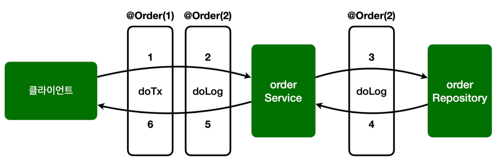

- 어드바이스는 기본적으로 순서를 보장하지 않음
- 순서를 지정하고 싶으면 `@Aspect` 적용 단위로 `org.springframework.core.annotaion.@Order` 애노테이션을 적용해야 함
	- 문제는 이것은 어드바이스 단위가 아닌, 클래스 단위로 적용할 수 있다는 점
	- 그래서 하나의 애스팩트에 여러 어드바이스가 있으면 순서를 보장받을 수 없어, 애스팩트를 별도의 클래스로 분리해아 함
- 현재 로그 순서는 `doLog()` -> `doTransaction()`이지만, 순서를 바꿔서 `doTransaction()` -> `doLog()`로 변경하자.

__AspectV5Order__

```java
package hello.aop.order.aop;  
  
import lombok.extern.slf4j.Slf4j;  
import org.aspectj.lang.ProceedingJoinPoint;  
import org.aspectj.lang.annotation.Around;  
import org.aspectj.lang.annotation.Aspect;  
import org.springframework.core.annotation.Order;  
  
@Slf4j  
public class AspectV5Order {  
    
  @Aspect  
  @Order(2)  
  public static class LogAspect {  
      
    @Around("hello.aop.order.aop.Pointcuts.allOrder()")  
    public Object doLog(ProceedingJoinPoint joinPoint) throws Throwable {  
      log.info("[log] {}", joinPoint.getSignature());  
      return joinPoint.proceed();  
    }  
      
  }  
    
  @Aspect  
  @Order(1)  
  public static class TxAspect {  
  
    @Around("hello.aop.order.aop.Pointcuts.orderAndService()")  
    public Object doTransaction(ProceedingJoinPoint joinPoint) throws Throwable {  
      try {  
        log.info("[트랜잭션 시작] {}", joinPoint.getSignature());  
        Object result = joinPoint.proceed(); // 실제 타겟이 되는 비즈니스 코드 호출  
        log.info("[트랜잭션 커밋] {}", joinPoint.getSignature());  
        return result;  
      } catch (Exception e) {  
        log.info("[트랜잭션 롤백] {}", joinPoint.getSignature());  
        throw e;  
      } finally {  
        log.info("[리소스 릴리즈] {}", joinPoint.getSignature());  
      }  
    }  
      
  }  
    
  
}
```

- 하나의 애스펙트 안에 있던 어드바이스를 `LogAspect`, `TxAspect` 애스펙트로 각각 분리했다
- 각 애스펙트에 `@Order` 애노테이션을 통해 실행 순서를 적용했다.
	- 참고로 숫자가 작을 수록 먼저 실행된다.

__AopTest - 변경__
```java
@Slf4j  
//@Import(AspectV1.class)  
//@Import(AspectV2.class)  
//@Import(AspectV3.class)  
//@Import(AspectV4Pointcut.class)  
@Import({AspectV5Order.LogAspect.class, AspectV5Order.TxAspect.class})  
@SpringBootTest  
public class AopTest {
	...
}
```

- `AspectV5Order`를 실행하기 위해서 다음 처리를 하자.
	- `@Import(AspectV4Pointcut.class)` 주석 처리
	- `@Import({AspectV5Order.LogAspect.class, AspectV5Order.TxAspect.class})` 추가

__실행 결과__

```
hello.aop.order.aop.AspectV5Order        : [트랜잭션 시작] void hello.aop.order.OrderService.orderItem(String)
hello.aop.order.aop.AspectV5Order        : [log] void hello.aop.order.OrderService.orderItem(String)
hello.aop.order.OrderService             : [orderService] 실행
hello.aop.order.aop.AspectV5Order        : [log] String hello.aop.order.OrderRepository.save(String)
hello.aop.order.OrderRepository          : [orderRepository 실행]
hello.aop.order.aop.AspectV5Order        : [트랜잭션 커밋] void hello.aop.order.OrderService.orderItem(String)
hello.aop.order.aop.AspectV5Order        : [리소스 릴리즈] void hello.aop.order.OrderService.orderItem(String)
```

실행 결과 확인 시 트랜잭션 어드바이스가 먼저 실행되는 것이 보인다.

