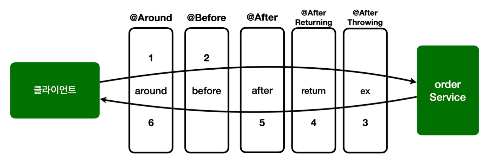

어드바이스는 `@Around`외에도 여러 종류가 있다.
#### 어드바이스 종류
- `@Around`: 메서드 호출 전후에 수행, 가장 강력한 어드바이스, 조인 포인트 실행 여부 선택, 반환 값 변환, 예외 변환 등이 가능
- `@Before`: 조인 포인트 실행 이전에 실행
- `@AfterReturning`: 조인 포인트가 정상 완료된 후 실행
- `@AfterThrowing`: 메서드가 예외를 던지는 경우 실행
- `@After`: 조인 포인트가 정상 또는 예외에 관계없이 실행(finally)

```java
package hello.aop.order.aop;  
  
import lombok.extern.slf4j.Slf4j;  
import org.aspectj.lang.JoinPoint;  
import org.aspectj.lang.ProceedingJoinPoint;  
import org.aspectj.lang.annotation.After;  
import org.aspectj.lang.annotation.AfterReturning;  
import org.aspectj.lang.annotation.AfterThrowing;  
import org.aspectj.lang.annotation.Around;  
import org.aspectj.lang.annotation.Aspect;  
import org.aspectj.lang.annotation.Before;  
  
@Slf4j  
@Aspect  
public class AspectV6Advice {  
  
  @Around("hello.aop.order.aop.Pointcuts.orderAndService()")  
  public Object doTransaction(ProceedingJoinPoint joinPoint) throws Throwable {  
    try {  
      // @Before  
      log.info("[around][트랜잭션 시작] {}", joinPoint.getSignature());  
      Object result = joinPoint.proceed(); // 실제 타겟이 되는 비즈니스 코드 호출  
      // @AfterReturning      log.info("[around][트랜잭션 커밋] {}", joinPoint.getSignature());  
      return result;  
    } catch (Exception e) {  
      // @AfterThrowing  
      log.info("[around][트랜잭션 롤백] {}", joinPoint.getSignature());  
      throw e;  
    } finally {  
      // @After  
      log.info("[around][리소스 릴리즈] {}", joinPoint.getSignature());  
    }  
  }  
  
  @Before("hello.aop.order.aop.Pointcuts.orderAndService()")  
  public void doBefore(JoinPoint joinPoint) {  
    log.info("[before] {}", joinPoint.getSignature());  
  }  
  
  @AfterReturning(value = "hello.aop.order.aop.Pointcuts.orderAndService()", returning = "result")  
  public void doReturn(JoinPoint joinPoint, Object result) {  
    log.info("[return] {} return = {}", joinPoint.getSignature(), result);  
  }  
  
  @AfterThrowing(value = "hello.aop.order.aop.Pointcuts.orderAndService()", throwing = "ex")  
  public void doThrowing(JoinPoint joinPoint, Exception ex) {  
    log.info("[ex] {} message = {}", joinPoint.getSignature(), ex.getMessage());  
  }  
  
  @After("hello.aop.order.aop.Pointcuts.orderAndService()")  
  public void doAfter(JoinPoint joinPoint) {  
    log.info("[after] {}", joinPoint.getSignature());  
  }  
  
}
```

`doTransaction()` 메서드에 남겨둔 주석을 확인하면 `@Around`를 제외한 나머지 어드바이스들은 `@Around`가 할 수 있는 일의 일부만 제공할 뿐이다.
따라서 `@Around` 어드바이스만 사용해도 필요한 기능을 모두 수행할 수 있다.

##### 참고 정보 획득
모든 어드바이스는 `org.aspectj.lang.JoinPoint`를 첫번째 파라미터에 사용할 수 있다.(생략 가능)
단, `@Around`는 `ProceedingJoinPoint`를 사용해야 한다.

`ProceedingJoinPoint`는 `org.aspectj.lang.JoinPoint`의 하위 타입이다.

__JoinPoint 인터페이스의 주요 기능__
- `getArgs()`: 메서드 인수 반환
- `getThis()`: 프록시 객체를 반환
- `getTarget()`: 대상 객체를 반환
- `getSignature()`: 조인되는 메서드에 대한 설명을 반환
- `toString()`: 조인되는 방법에 대한 유용한 설명을 인쇄

__ProceedingJoinPoint 인터페이스의 주요 기능__
- `proceed()`: 다음 어드바이스나 타겟을 호출한다.
	- 추가로 호출 시 전달한 매개변수를 파라미터를 통해서도 전달 받을 수도 있다.

__@Before__
조인 포인트 실행 전
```java
@Before("hello.aop.order.aop.Pointcuts.orderAndService()")  
public void doBefore(JoinPoint joinPoint) {  
  log.info("[before] {}", joinPoint.getSignature());  
}
```
`@Around`와 다르게 작업 흐름을 변경할 수는 없다.
`@Around`는 `ProceedingJoinPoint.preceed()`를 호출해야 다음 대상이 호출된다. 만약 호출하지 않으면 다음 대상이 호출되지 않는다.
반면 `@Before`는 `ProceedingJoinPoint.proceed()` 자체를 사용하지 않는다. 메서드 종료 시 자동으로 다음 타겟이 호출된다. (물론 예외 발생 시 다음 코드 호출되지 않음.)

__@AfterReturning__
메서드 실행이 정상적으로 반환될 때 실행
```java
@AfterReturning(value = "hello.aop.order.aop.Pointcuts.orderAndService()", returning = "result")  
public void doReturn(JoinPoint joinPoint, Object result) {  
  log.info("[return] {} return = {}", joinPoint.getSignature(), result);  
}
```
- `returning` 속성에 사용된 이름은 어드바이스 메서드의 매개변수 이름과 일치해야 한다.
- `returning` 절에 지정된 타입의 값을 반환하는 메서드만 대상으로 실행한다. (부모 타입을 지정하면 모든 자식 타입은 인정된다.)
	- Parent 클래스의 자식 클래스로 Child가 있을 경우 Parent result를 파라미터로 지정 시 Child는 인정되지만, Aunt는 안된다.
- `@Around`와 다르게 반환되는 객체를 변경할 수는 없다. 반환 객체를 변경하려면 `@Around`를 사용해야 한다. 참고로 반환 객체를 조작할 수는 있다.
	- 이는 반환 타입이나, 반환 객체의 새로운 레퍼런스(new SomeClass();)를 지정할 수는 없지만, set 메서드 등을 사용하여 값을 변경할 수는 있다는 뜻

__@AfterThrowing__
메서드 실행이 예외를 던져서 종료될 때 실행
```java
@AfterThrowing(value = "hello.aop.order.aop.Pointcuts.orderAndService()", throwing = "ex")  
public void doThrowing(JoinPoint joinPoint, Exception ex) {  
  log.info("[ex] {} message = {}", joinPoint.getSignature(), ex.getMessage());  
}
```
- `throwing` 속성에 사용된 이름은 어드바이스 매개변수 이름과 일치해야 한다.
- `throwing` 절에 지정된 타입과 맞는 예외를 대상으로 실행한다. (부모 타입 지정 시 모든 자식 타입은 인정)

__@After__
```java
@After("hello.aop.order.aop.Pointcuts.orderAndService()")  
public void doAfter(JoinPoint joinPoint) {  
  log.info("[after] {}", joinPoint.getSignature());  
}
```
- 메서드 실행이 종료되면 실행 (finally를 생각하면 된다.)
- 정상 및 예외 반환 조건을 모두 처리한다.
- 일반적으로 리소스를 해제하는 데 사용
- 리턴 값을 조작할 수는 없다.

__@Around__
```java
@Around("hello.aop.order.aop.Pointcuts.orderAndService()")  
public Object doTransaction(ProceedingJoinPoint joinPoint) throws Throwable {  
  try {  
    // @Before  
    log.info("[around][트랜잭션 시작] {}", joinPoint.getSignature());  
    Object result = joinPoint.proceed(); // 실제 타겟이 되는 비즈니스 코드 호출  
    // @AfterReturning    log.info("[around][트랜잭션 커밋] {}", joinPoint.getSignature());  
    return result;  
  } catch (Exception e) {  
    // @AfterThrowing  
    log.info("[around][트랜잭션 롤백] {}", joinPoint.getSignature());  
    throw e;  
  } finally {  
    // @After  
    log.info("[around][리소스 릴리즈] {}", joinPoint.getSignature());  
  }  
}
```
- 메서드의 실행 주변에서 실행 (메서드 실행 전후에 작업 수행)
- 가장 강력한 어드바이스
	- 조인 포인트 실행 여부 선택 `joinPoint.proceed() 호출 여부 선택`
	- 전달 값 변환: `joinPoint.proceed(args[])`
	- 반환 값 변환
	- 예외 변환
	- 트랜잭션 처럼 `try ~ catch ~ finally` 모두 들어가는 구문 처리 가능
- 어드바이스의 첫 번째 파라미터는 `ProceedingJoinPoint`를 모두 사용해야 한다.
- `proceed()`를 통해 대상을 실행한다.
- `proceed()`를 여러번 실행할 수도 있음(재시도)

__AopTest - 변경__
```java
@Slf4j  
//@Import(AspectV1.class)  
//@Import(AspectV2.class)  
//@Import(AspectV3.class)  
//@Import(AspectV4Pointcut.class)  
//@Import({AspectV5Order.LogAspect.class, AspectV5Order.TxAspect.class})  
@Import(AspectV6Advice.class)  
@SpringBootTest  
public class AopTest {
	...
}
```

```
[around][트랜잭션 시작] void hello.aop.order.OrderService.orderItem(String)
[before] void hello.aop.order.OrderService.orderItem(String)
[orderService] 실행  
[orderRepository] 실행
[return] void hello.aop.order.OrderService.orderItem(String) return=null
[after] void hello.aop.order.OrderService.orderItem(String)
[around][트랜잭션 커밋] void hello.aop.order.OrderService.orderItem(String)
[around][리소스 릴리즈] void hello.aop.order.OrderService.orderItem(String)
```



__순서__
- 스프링은 5.2.7 버전부터 동일한 `@Aspect`안에서 동일한 조인포인트의 우선순위를 정했다.
- 실행 순서: `@Around`, `@Before`, `@After`, `@AfterReturning`, `@AfterThrowing`
- 어드바이스가 적용되는 순서는 이렇게 적용되지만, 호출 순서와 리턴 순서는 반대라는 점을 알아두자.
- 물론 `@Aspect`안에 동일한 종류의 어드바이스가 두 개 있다면 순서가 보장되지 않는다. 이 경우 `@Aspect`를 분리하고 `@Order`를 통해 순서를 보장시켜야 한다.

#### @Around 외에 다른 어드바이스가 존재하는 이유
`@Around` 하나만 있어도 모든 기능을 수행할 수 있다. 그런데 다른 어드바이스들이 존재하는 이유는 무엇일까?

다음 코드를 보자.
```java
@Around("hello.aop.order.aop.Pointcuts.orderAndService()")
public void doBefore(ProceedingJoinPoint joinPoint) {
 log.info("[before] {}", joinPoint.getSignature());
}
```
이 코드는 타겟을 호출하지 않는 문제가 있다. 
이 코드를 개발한 의도는 타겟 실행 전에 로그를 출력하는 것이다. 그런데 `@Around`는 항상 `joinPoint.proceed()`를 호출해야 한다.
만약 실수로 호출하지 않으면 타겟이 호출되지 않는 치명적인 버그가 발생한다.

다음 코드를 보자.
```java
@Before("hello.aop.order.aop.Pointcuts.orderAndService()")
public void doBefore(JoinPoint joinPoint) {
 log.info("[before] {}", joinPoint.getSignature());
}
```
`@Before`는 `joinPoint.proceed()`를 호출하는 고민을 하지 않아도 된다.

`@Around`가 가장 넓은 기능을 제공하는 것은 맞지만, 실수할 가능성이 있다.
반면에 `@Before`, `@After`같은 어드바이스는 기능은 적지만 실수할 가능성이 낮고, 코드도 단순하다.
그리고 가장 중요한 점이 있는데, 바로 이 코드를 작성한 의도가 명확하게 드러난다는 점이다.
`@Before`라는 애노테이션을 보는 순간 `아~ 이 코드는 타켓 실행 전에 한정해서 어떤 일을 하는 코드구나` 라는 것이 드러난다.

##### 좋은 설계는 제약이 있는 것이다.
좋은 설계는 제약이 있는 것이다. `@Around만 있으면 되는데 왜? 이렇게 제약을 두는가?` 제약은 실수를 미연에 방지한다.
일종의 가이드 역할을 한다.
만약 `@Around`를 사용했는데, 중간에 다른 개발자가 해당 코드를 수정해서 호출하지 않았다면? 큰 장애가 발생했을 것이다.
처음부터 `@Before`를 사용했다면 이런 문제 자체가 발생하지 않는다.
제약 덕분에 역할이 명확해진다. 다른 개발자도 이 코드를 보고 고민해야 하는 범위가 줄어들고 코드의 의도도 파악하기 쉽다.