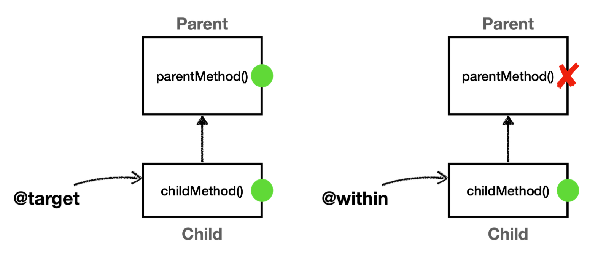

## @target, @within
- 정의
	- `@target`: 실행 객체의 클래스에 주어진 타입의 애노테이션이 있는 조인 포인트
	- `@within`: 주어진 애노테이션이 있는 타입 내 조인 포인트
- 설명
	- `@target`, `@within`은 다음과 같이 타입에 있는 애노테이션으로 AOP 적용 여부를 판단한다.
		- `@target(hello.aop.member.annotation.ClassAop`
		- `@within(hello.aop.member.annotation.ClassAop`
	```java
	@ClassAop
	class Target {}
	```

__@target vs @within__
- `@target`은 인스턴스의 모든 메서드를 조인 포인트로 적용
- `@within`은 해당 타입 내에 있는 메서드만 조인 포인트로 적용

쉽게 풀면 `@target`은 부모 클래스의 메서드까지 어드바이스를 다 적용하고, `@within`은 자기 자신의 클래스에 정의된 메서드에만 어드바이스를 적용한다.



#### 
```java
package hello.aop.pointcut;  
  
import hello.aop.member.annotation.ClassAop;  
import lombok.extern.slf4j.Slf4j;  
import org.aspectj.lang.ProceedingJoinPoint;  
import org.aspectj.lang.annotation.Around;  
import org.aspectj.lang.annotation.Aspect;  
import org.junit.jupiter.api.Test;  
import org.springframework.beans.factory.annotation.Autowired;  
import org.springframework.boot.test.context.SpringBootTest;  
import org.springframework.context.annotation.Bean;  
import org.springframework.context.annotation.Import;  
  
@Slf4j  
@Import({AtTargetAtWithinTest.Config.class})  
@SpringBootTest  
public class AtTargetAtWithinTest {  
  
  @Autowired  
  Child child;  
  
  @Test  
  void success() {  
    log.info("child proxy = {}", child.getClass());  
    child.childMethod(); // 부모, 자식 모두 있는 메서드  
    child.parentMethod(); // 부모에만 있는 메서드  
  }  
  
  static class Config {  
  
    @Bean  
    public Parent parent() {  
      return new Parent();  
    }  
  
    @Bean  
    public Child child() {  
      return new Child();  
    }  
  
    @Bean  
    public AtTargetAtWithinAspect atTargetAtWithinAspect() {  
      return new AtTargetAtWithinAspect();  
    }  
  
  }  
  
  static class Parent {  
    public void parentMethod() {} // 부모에만 있는 메서드  
  }  
  
  @ClassAop  
  static class Child extends Parent {  
    public void childMethod() {}  
  }  
  
  @Slf4j  
  @Aspect  static class AtTargetAtWithinAspect {  
    // @target: 인스턴스 기준으로 모든 메서드의 조인 포인트를 선정, 부모 타입의 메서드도 적용  
    @Around("execution(* hello.aop..*(..)) && @target(hello.aop.member.annotation.ClassAop)")  
    public Object atTarget(ProceedingJoinPoint joinPoint) throws Throwable {  
      log.info("[@target] {}", joinPoint.getSignature());  
      return joinPoint.proceed();  
    }  
  
    // @within: 선택된 클래스 내부에 있는 메서드만 조인 포인트로 선정, 부모 타입의 메서드는 적용되지 않음  
    @Around("execution(* hello.aop..*(..)) && @within(hello.aop.member.annotation.ClassAop)")  
    public Object atWithin(ProceedingJoinPoint joinPoint) throws Throwable {  
      log.info("[@within] {}", joinPoint.getSignature());  
      return joinPoint.proceed();  
    }  
  }  
}
```

__실행 결과__
```
child proxy = class hello.aop.pointcut.AtTargetAtWithinTest$Child$$SpringCGLIB$$0
[@target] void hello.aop.pointcut.AtTargetAtWithinTest$Child.childMethod()
[@within] void hello.aop.pointcut.AtTargetAtWithinTest$Child.childMethod()
[@target] void hello.aop.pointcut.AtTargetAtWithinTest$Parent.parentMethod()
```

`parentMethod()`는 `Parent`클래스에만 정의되어 있고, `Child`클래스에 정의되어 있지 않기 때문에 `@within`에서 AOP 적용 대상이 되지 않는다. 
실행결과를 보면 `child.parentMethod()`를 호출 했을 때 `[@within]`이 호출되지 않은 것을 확인할 수 있다.

> 참고
> `@target`, `@within` 지시자는 파라미터 바인딩에서 함께 사용된다.

> 주의
> 다음 포인트컷 지시자는 단독으로 사용하면 안된다. `args`, `@args`, `@target` 이번 예제를 보면 `execution(* hello.aop..*(..))`를 통해 적용 대상을 줄여준 것을 확인할 수 있다.
> `args`, `@args`, `@target`은 실제 객체 인스턴스가 생성되고 실행될 때 어드바이스 적용 여부를 확인할 수 있다.
> 실행 시점에 일어나는 포인트컷 적용 여부도 결국 프록시가 있어야 실행 시점에 판단할 수 있는데, 프록시가 없다면 판단 자체가 불가능하다.
> 그런데, 스프링 컨테이너가 프록시를 생성하는 시점은 스프링 컨테이너가 만들어지는 애플리케이션 로딩 시점에 적용할 수 있다. 따라서 `args`, `@args`, `@target`같은 포인트컷 지시자가 있으면 스프링은 모든 스프링 빈에 AOP를 적용하려고 시도한다.
> (스프링 AOP 특성: 프록시가 없으면 실행 시점에 판단 자체가 불가능)
> 문제는 이렇게 모든 스프링 빈에 AOP 프록시를 적용하려고 하면 스프링이 내부에서 사용하는 빈 중에는 `final`로 지정된 빈들도 있기 때문에 오류가 발생할 수 있다.
> 이런 표현식은 최대한 프록시 적용 대상을 축소하는 표현식과 함께 사용해야 한다.


__출처: 김영한 지식공유자의 스프링 핵심 원리 고급편__