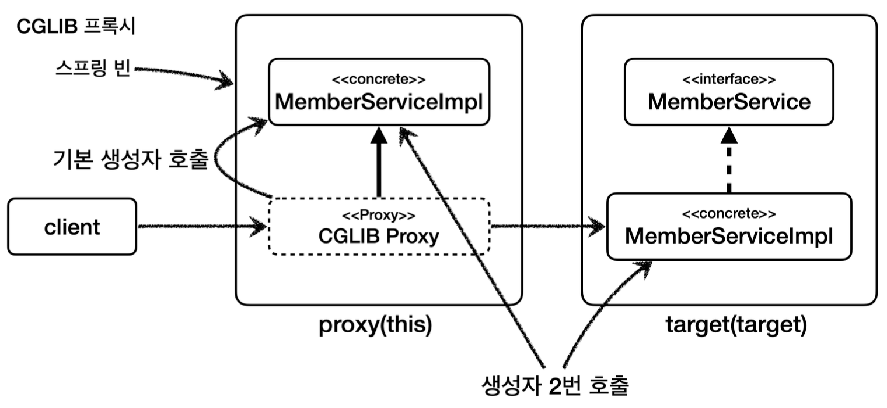

## 프록시 기술과 한계 - CGLIB
스프링에서 CGLIB는 구체 클래스를 상속 받아서 AOP 프록시를 생성할 때 사용한다.
CGLIB는 구체 클래스를 상속 받기 때문에 다음과 같은 문제가 있다.

__CGLIB 구체 클래스 기반 프록시 문제점__
- 대상 클래스에 기본 생성자 필수
- 생성자 두 번 호출 문제
- final 키워드 클래스, 메서드 사용 불가

하나씩 자세히 알아보자

#### 대상 클래스에 기본 생성자 필수
CGLIB는 구체 클래스를 상속 받는다.
자바에서 상속을 받으면 자식 클래스의 생성자를 호출할 때 자식 클래스의 생성자에서 부모 클래스의 생성자도 호출해야 한다. (이 부분이 생략되어 있다면 자식 클래스의 생성자 첫 줄에 부모 클래스의 기본 생성자를 호출하는 `super()`가 자동으로 들어간다.)
이 부분은 자바의 문법 규약이다.

CGLIB를 사용할 때 CGLIB가 만드는 프록시의 생성자는 우리가 호출하는 것이 아니다. CGLIB 프록시는 대상 클래스를 상속 받고, 생성자에서 대상 클래스의 긱본 생성자를 호출한다.
따라서 대상 클래스에 기본 생성자를 만들어야 한다.
(기본 생성자는 생성자가 하나도 없을 경우 자동으로 만들어짐)

#### 생성자 두 번 호출 문제
CGLIB는 구체 클래스를 상속 받는다. 자바에서 상속을 받으면 자식 클래스의 생성자를 호출할 때 부모 클래스의 생성자도 호출해야 한다. 그런데 왜 두 번일까?
1. 실제 target의 객체를 생성할 때
2. 프록시 객체를 생성할 때 부모 클래스의 생성자 호출

실제 내가 target 객체를 생성할 때 생성자가 호출되고, 이를 바탕으로 Proxy 객체를 만들기 위해 Proxy에서 target에 대한 생성자를 호출하게 된다.
#### final 키워드 클래스, 메서드 사용 불가
final 키워드가 클래스에 있으면 상속이 불가능하고, 메서드에 있으면 오버라이딩이 불가능하다. CGLIB는 상속을 기반으로 하기 때문에 두 경우 프록시가 생성되지 않거나, 정상 작동하지 않는다.

프레임워크 같은 개발이 아니라, 일반적인 웹 애플리케이션 개발 시에 `final` 키워드를 잘 사용하지 않아 특별한 문제가 되지 않는다.

__출처: 김영한 지식공유자의 스프링 핵심 원리 고급편__