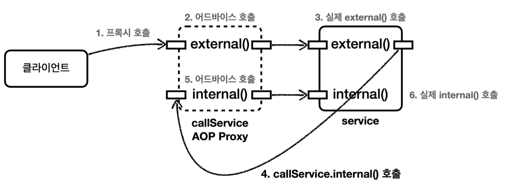

## 프록시와 내부 호출 - 대안1 자기 자신 주입
내부 호출을 해결하는 가장 간단한 방법은 자기 자신을 의존관계 주입 받는 것이다.

__CallServiceV1__
```java
package hello.aop.internalcall;  
  
import lombok.extern.slf4j.Slf4j;  
import org.springframework.beans.factory.annotation.Autowired;  
import org.springframework.stereotype.Component;  
  
  
/*  
* 참고: 생성자 주입은 순환 사이클을 만들기 때문에 실패한다.  
* */  
@Slf4j  
@Component  
public class CallServiceV1 {  
  
  private CallServiceV1 callServiceV1;  
  
  @Autowired  
  public void setCallServiceV1(CallServiceV1 callServiceV1) {  
    this.callServiceV1 = callServiceV1;  
  }  
  
  public void external() {  
    log.info("call external");  
    callServiceV1.internal(); // 외부 메서드 호출  
  }  
  
  public void internal() {  
    log.info("call internal");  
  }  
  
}
```

`callServiceV1`를 수정자를 통해 주입 받는 것을 확인할 수 있다. 스프링에서 AOP가 적용된 대상을 의존관계 주입 받으면 주입 받은 대상은 실제 자신이 아니라 프록시 객체이다.
`external()`을 호출하면 `callServiceV1.internal()`을 호출하게 된다. 주입받은 `callServiceV1`은 프록시이다. 따라서 프록시를 통해서 AOP 적용이 가능하다.

참고로, 이 경우 생성자 주입 시 오류가 발생한다. 본인을 생성하면서 본인을 주입해야 하기 때문에 순환 사이클이 만들어진다.
반면 수정자 주입은 스프링이 생성된 이후에 주입할 수 있기 때문에 오류가 발생하지 않는다.

__CallServiceV1Test__
```java
@Import(CallLogAspect.class)  
@SpringBootTest(properties = "spring.main.allow-circular-references=true")  
class CallServiceV1Test {  
  
  @Autowired  
  CallServiceV1 callServiceV1;  
  
  @Test  
  void external() {  
    callServiceV1.external();  
  }  
  
}
```

> 주의
> 스프링 부트 2.6부터는 순환 참조를 기본적으로 금지하도록 정책이 변경되었다. 따라서 이번 예제를 스프링 부트 2.6 이상의 버전에서 실행하면 다음과 같은 오류 메시지가 나오면서 정상 실행되지 않는다.
> 
> `Error creating bean with name 'callServiceV1': Requested bean is currently in creation: Is there an unresolvable circular reference?`
> 
> 이 문제를 해결하려면 `application.properties`에 다음을 추가해야 한다. `spring.main.allow-circular-references=true`

__실행 결과__
```
aop = void hello.aop.internalcall.CallServiceV1.external()
call external
aop = void hello.aop.internalcall.CallServiceV1.internal()
call internal
```




실행 결과를 보면 이제는 `internal()`을 호출할 때 자기 자신의 인스턴스를 호출하는 것이 아니라 프록시 인스턴스를 통해서 호출하는 것을 확인할 수 있다. 당연히 AOP도 잘 적용된다.


__출처: 김영한 지식공유자의 스프링 핵심 원리 고급편__