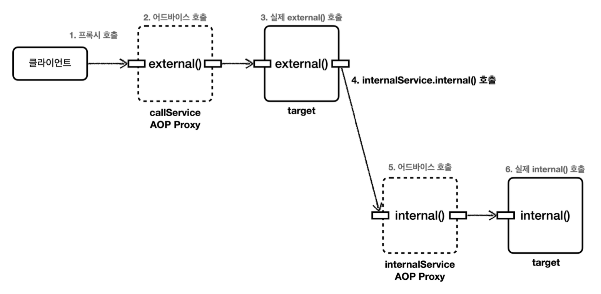

## 프록시와 내부 호출 - 대안 3 구조 변경
자기 자신 주입이나, 지연 조회의 경우 자기 자신을 주입하거나, `Provider`를 사용해야 하는 것 처럼 조금 어색한 모습을 만들었다.
가장 나은 대안은 내부 호출이 발생하지 않도록 구조를 변경하는 것이다. 실제 이 방법을 가장 권장한다.

__CallServiceV3__
```java
package hello.aop.internalcall;  
  
import lombok.RequiredArgsConstructor;  
import lombok.extern.slf4j.Slf4j;  
import org.springframework.stereotype.Component;  
  
/*  
* 구조를 변경 (분리)  
* */  
@Slf4j  
@Component  
@RequiredArgsConstructor  
public class CallServiceV3 {  
    
  private final InternalService internalService;  
    
  public void external() {  
    log.info("call external");  
    internalService.internal();  
  }  
    
}
```

__InternalService__
```java
package hello.aop.internalcall;  
  
import lombok.extern.slf4j.Slf4j;  
import org.springframework.stereotype.Component;  
  
@Slf4j  
@Component  
public class InternalService {  
  
  public void internal() {  
    log.info("call internal");  
  }  
  
}
```

__CallServiceV3Test__
```java
package hello.aop.internalcall;  
  
import hello.aop.internalcall.aop.CallLogAspect;  
import org.junit.jupiter.api.Test;  
import org.springframework.beans.factory.annotation.Autowired;  
import org.springframework.boot.test.context.SpringBootTest;  
import org.springframework.context.annotation.Import;  
  
@Import(CallLogAspect.class)  
@SpringBootTest  
class CallServiceV3Test {  
  
  @Autowired  
  CallServiceV3 callServiceV3;  
  
  @Test  
  void external() {  
    callServiceV3.external();  
  }  
}
```

__실행 결과__
```
aop = void hello.aop.internalcall.CallServiceV3.external()
call external
aop = void hello.aop.internalcall.InternalService.internal()
call internal
```


내부 호출 자체가 사라지고 `CallService` -> `InternalService`를 호출하는 구조로 변경되었다. 자연스럽게 AOP가 적용된다.

여기서 구조를 변경한다는 것은 이렇게 단순하게 분리하는 것 뿐만 아니라 다양한 방법들이 있을 수 있다.

예를 들어서 다음과 같이 클라이언트에서 둘다 호출하는 것이다. 
`클라이언트` -> `external()`  
`클라이언트` -> `internal()`

물론 이 경우 `external()`에서 `internal()`을 내부 호출하지 않도록 코드를 변경해야 한다.
그리고 클라이언트가 `external()`, `internal()`을 모두 호출하도록 구조를 변경하면 된다. (물론 가능한 경우에 한해서)

> 참고
> AOP는 주로 트랜잭션 적용이나, 주요 컴포넌트의 로그 출력 기능에 사용된다.
> 쉽게 이야기해서 인터페이스에 메서드가 나올 정도의 규모에 AOP를 적용하는 것이 적당하다. (좀 크게크게 큰 단위에 쓴다는 뜻)
> 더 풀어서 이야기하면 AOP는 public 메서드에만 적용한다. `private` 메서드처럼 작은 단위에는 AOP를 적용하지 않는다. (적용 되지도 않는다.)
> 
> AOP 적용을 위해 `private` 메서드를 외부 클래스로 변경하고 `public`으로 변경하는 일은 거의 없다. 그러나 위 예제와 같이 `public` 메서드에서 `public`메서드를 내부 호출하는 경우에는 문제가 발생한다. 실무에서 꼭 만나는 문제이다.
> AOP가 잘 적용되지 않으면 내부 호출을 의심해보자.


__출처: 김영한 지식공유자의 스프링 핵심 원리 고급편__