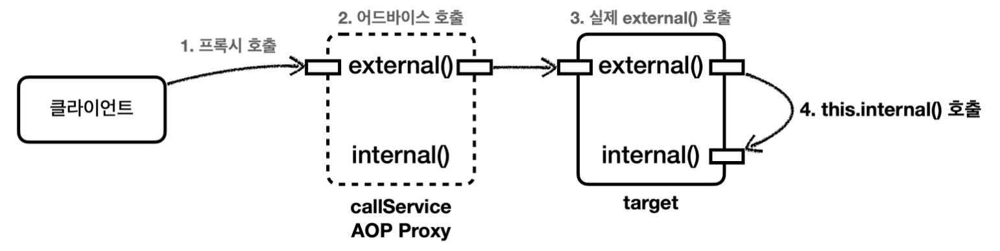
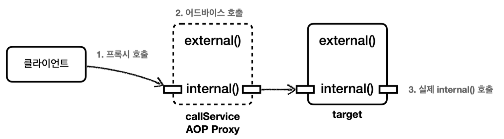

## 프록시와 내부 호출 문제
스프링은 프록시 방식의 AOP를 사용한다.
따라서 AOP를 적용하려면 항상 프록시를 통해서 대상 객체(Target)을 호출해야 한다.
이렇게 해야 프록시에서 먼저 어드바이스를 호출하고, 이후에 대상 객체를 호출한다.
만약 프록시를 거치지 않고 대상 객체를 직접 호출하게 되면 AOP가 적용되지 않고, 어드바이스도 호출되지 않는다.

AOP를 적용하면 스프링은 대상 객체 대신에 프록시를 스프링 빈으로 등록한다. 따라서 스프링은 의존관계 주입 시 항상 프록시 객체를 주입한다.
프록시 객체가 주입되기 때문에 대상 객체를 직접 호출하는 문제는 일반적으로 발생하지 않는다. 하지만 대상 객체의 내부에서 메서드 호출이 발생하면 프록시를 거치지 않고, 대상 객체를 직접 호출하는 문제가 발생한다.

예제를 통해 알아보자

__CallServiceV0__
```java
package hello.aop.internalcall;  
  
import lombok.extern.slf4j.Slf4j;  
import org.springframework.stereotype.Component;  
  
@Slf4j  
@Component  
public class CallServiceV0 {  
  
  public void external() {  
    log.info("call external");  
    internal(); // 내부 메서드 호출 (this.internal())  
  }  
  
  public void internal() {  
    log.info("call internal");  
  }  
  
}
```
`CallServiceV0.external()`을 호출하면 내부에서 `internal()`이라는 자기 자신의 메서드를 호출한다.

__CallLogAspect__
```java
package hello.aop.internalcall.aop;  
  
import lombok.extern.slf4j.Slf4j;  
import org.aspectj.lang.JoinPoint;  
import org.aspectj.lang.annotation.Aspect;  
import org.aspectj.lang.annotation.Before;  
  
@Slf4j  
@Aspect  
public class CallLogAspect {  
    
  @Before("execution(* hello.aop.internalcall..*.*(..))")  
  public void doLog(JoinPoint joinPoint) {  
    log.info("aop = {}", joinPoint.getSignature());  
  }  
  
}
```
`CallServiceV0`에 AOP를 적용하기 위한 간단한 `Aspect`

__CallServiceV0Test__
```java
package hello.aop.internalcall;  
  
import hello.aop.internalcall.aop.CallLogAspect;  
import org.junit.jupiter.api.Test;  
import org.springframework.beans.factory.annotation.Autowired;  
import org.springframework.boot.test.context.SpringBootTest;  
import org.springframework.context.annotation.Import;  
  
@Import(CallLogAspect.class)  
@SpringBootTest  
public class CallServiceV0Test {  
    
  @Autowired  
  CallServiceV0 callServiceV0;  
    
  @Test  
  void external() {  
    callServiceV0.external();  
  }  
    
  @Test  
  void internal() {  
    callServiceV0.internal();  
  }  
  
}
```
이제 앞서 만든 `CallServiceV0`을 실행할 수 있는 테스트 코드를 만들자.  
- `@Import(CallLogAspect.class)`: 앞서 만든 간단한 `Aspect`를 스프링 빈으로 등록한다. 이렇게 해서 `CallServiceV0`에 AOP 프록시를 적용한다.  
- `@SpringBootTest`: 내부에 컴포넌트 스캔을 포함하고 있다. `CallServiceV0`에 `@Component`가 붙어 있으므로 스프링 빈 등록 대상이 된다.

먼저 `callServiceV0.external()`을 실행해보자. 이 부분이 중요하다.

__실행 결과 - external()__
```
CallLogAspect >>> aop = void hello.aop.internalcall.CallServiceV0.external()
CallServiceV0 >>> call external
CallServiceV0 >>> call internal
```



실행 결과를 보면 `callServiceV0.external()`을 실행할 때는 프록시를 호출한다. 따라서 `CallLogAspect` 어드바이스가 호출된 것을 확인할 수 있다.
그리고 AOP Proxy는 `target.external()`을 호출한다.
그런데 여기서 문제는 `callServiceV0.external()`안에서 `internal()`을 호출할 때 발생한다. 이때는 `CallLogAspect` 어드바이스가 호출되지 않는다.

자바 언어에서 메서드 앞에 별도의 참조가 없으면 `this`라는 뜻으로 자기 자신의 인스턴스를 가리킨다.  
결과적으로 자기 자신의 내부 메서드를 호출하는 `this.internal()`이 되는데, 여기서 `this`는 실제 대상 객체 (target)의 인스턴스를 뜻한다.
결과적으로 이러한 내부 호출은 프록시를 거치지 않는다. 따라서 어드바이스도 적용할 수 없다.

이번에는 외부에서 `internal()`을 호출하는 테스트를 실행하면 아래 결과가 나온다

__실행 결과 - internal()__
```
CallLogAspect >>> aop = void hello.aop.internalcall.CallServiceV0.internal()
CallServiceV0 >>> call internal
```

외부에서 호출하는 경우 프록시를 거치기 때문에 `internal()`도 `CallLogAspect` 어드바이스가 적용된 것을 확인할 수 있다.

#### 프록시 방식의 AOP 한계
스프링은 프록시 방식의 AOP를 사용한다. 프록시 방식의 AOP는 메서드 내부 호출에 프록시를 적용할 수 없다. 이 문제를 해결하는 방법을 하나씩 알아보자.

> 참고
> 실제 코드에서 AOP를 직접 적용하는 AspectJ를 사용하면 이런 문제가 발생하지 않는다. 프록시를 통하는 것이 아니라 해당 코드에 직접 AOP 적용 코드가 붙어 있기 때문에 내부 호출과 무관하게 AOP를 적용할 수 있다.
> 하지만, 로드 타임 위빙 등을 사용해야 하는데, 설정이 복잡하고 JVM 옵션을 주어야 하는 부담도 있다. 그리고 지금부터 설명할 프록시 방식의 AOP에서 내부 호출에 대응할 수 있는 대안들도 있다.
> 
> 이런 이유로 AspectJ를 직접 사용하는 방법은 실무에서 거의 사용하지 않지만, 스프링에서 함께 직접 AspectJ를 사용하는 방법은 아래 레퍼런스를 참고하면 된다.
> https://docs.spring.io/spring-framework/docs/current/reference/html/core.html#aop-using-aspectj


__출처: 김영한 지식공유자의 스프링 핵심 원리 고급편__