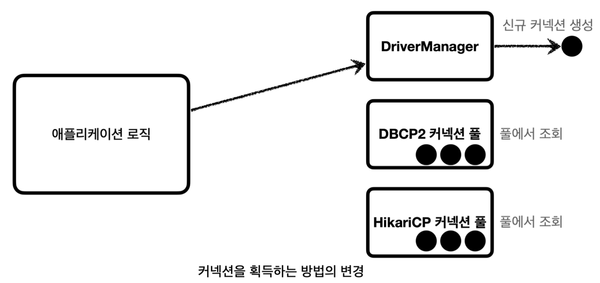
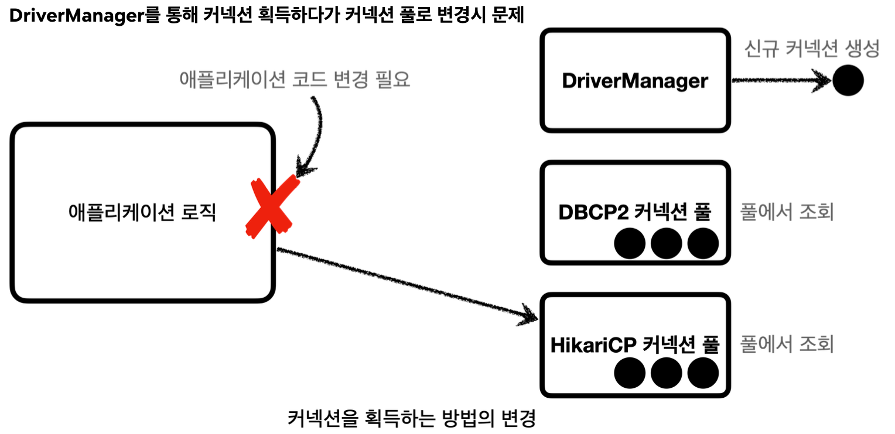

커넥션을 얻는 방법은 JDBC`DriverManager`를 직접 사용하거나, 커넥션 풀을 사용하는 등 다양한 방법이 존재한다.


__커넥션을 획득하는 다양한 방법__


__DriverManager를 통해 커넥션 획득__

- 앞서 JDBC로 개발한 애플리케이션처럼 `DriverManager`를 통해 커넥션을 획득하다가, 커넥션 풀을 사용하는 방법으로 변경하려면 어떻게 해야할까

__DriverManager를 통해 커넥션 획득하다가 커넥션 풀로 변경 시 문제__

- 예를 들어서 애플리케이션 로직에서 `DriverManager`를 사용해서 커넥션을 획득하다가 `HikariCP`같은 커넥션 풀을 사용하도록 변경하면 커넥션을 획득하는 애플리케이션 코드도 함께 변경해야 한다.
- 의존관계가 `DriverManager`에서 `HikariCP`로 변경되기 때문이다. 물론 둘의 사용법도 조금씩 다를 것이다.

__커넥션을 획득하는 방법을 추상화__

- 자바에서는 이런 문제를 해결하기 위해 `javax.sql.DataSource`라는 인터페이스를 제공한다.
- `DataSource`는 **커넥션을 획득하는 방법을 추상화** 하는 인터페이스이다.
- 이 인터페이스의 핵심 기능은 커넥션 조회 하나이다. (다른 일부 기능도 있지만 크게 중요하지 않다.)
- 클라이언트는 구현된 `DataSource`를 그냥 불러다가 커넥션을 가져오기만 하면 된다.

__DataSource 핵심 기능만 축약__
```
public interface DataSource {
    Connection getConnection() throws SQLException;
}
```

## 정리
- 대부분의 커넥션 풀은 `DataSource`인터페이스를 이미 구현해두었다.
- 따라서 개발자는 `DBCP2 커넥션 풀`, `HikariCP 커넥션 풀`의 코드를 직접 의존하는 것이 아니라 `DataSource`인터페이스에만 의존하도록 애플리케이션 로직을 작성하면 된다. 
- 커넥션 풀 구현 기술을 변경하고 싶으면 해당 구현체로 갈아끼우기만 하면 된다.
- `DriverManager`는 `DataSource` 인터페이스를 사용하지 않는다. 따라서 `DriverManager`는 직접 사용해야 한다.
- 따라서 `DriverManager`를 사용하다가 `DataSource`기반의 커넥션 풀을 사용하도록 변경하면 관련 코드를 다 고쳐야 한다.
- 이런 문제를 해결하기 위해 스프링은 `DriverManager`도 `DataSource`를 통해서 사용할 수 있도록 `DriverManagerDataSource`라는 `DataSource`를 구현한 클래스를 제공한다.
- 자바는 `DataSource`를 통해 커넥션을 획득하는 방법을 추상화했다.
- 이제 애플리케이션 로직은 `DataSource`인터페이스에만 의존하면 된다. 
- 덕분에 `DriverManagerDataSource`를 통해서 `DriverManager`를 사용 하다가 커넥션 풀을 사용하도록 코드를 변경해도 애플리케이션 로직은 변경하지 않아도 된다.


__출처: 인프런 김영한 지식공유자님의 강의 - 스프링 DB 1편__