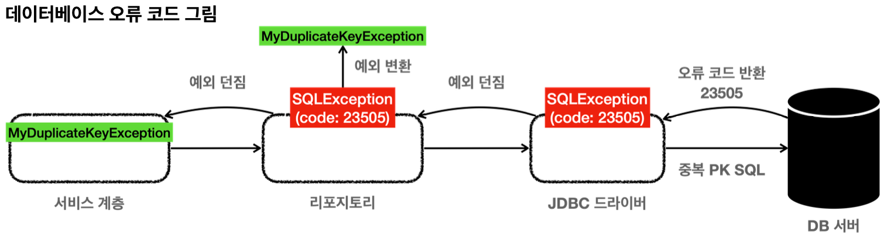

데이터베이스 오류에 따라서 특정 예외는 복구하고 싶을 수 있다.
예를 들어서 회원 가입시 DB에 이미 같은 ID가 있으면 ID 뒤에 숫자를 붙여서 새로운 ID를 만들어야 한다고 가정해보자.  
ID를 `hello`라고 가입 시도 했는데, 이미 같은 아이디가 있으면 `hello12345`와 같이 뒤에 임의의 숫자를 붙여서 가입하는 것이다.

데이터를 DB에 저장할 때 같은 ID가 이미 데이터베이스에 저장되어 있다면, 데이터베이스는 오류 코드를 반환하고, 이 오류 코드를 받은 JDBC 드라이버는 `SQLException`을 던진다.
그리고 `SQLException`에는 데이터베이스가 제공하는 `errorCode`라는 것이 들어있다.



**H2 데이터베이스의 키 중복 오류 코드** 
```java
e.getErrorCode() == 23505
```

`SQLException` 내부에 들어있는 `errorCode`를 활용하면 데이터베이스에서 어떤 문제가 발생했는지 확인할 수 있다.

**H2 데이터베이스 예**
- `23505`: 키 중복 오류
- `42000`: SQL 문법 오류

같은 오류여도 각각의 데이터베이스마다 정의된 오류 코드가 다르다. 따라서 오류 코드를 사용할 때는 데이터베이스 매뉴얼을 확인해야 한다.

서비스 계층에서는 예외 복구를 위해 키 중복 오류를 확인할 수 있어야 한다.
그래야 새로운 ID를 만들어서 다시 저장을 시도할 수 있기 때문이다. 이러한 과정이 바로 예외를 확인해서 복구하는 과정이다.
리포지토리는 `SQLException`을 서비스 계층에 던지고 서비스 계층은 이 예외의 오류 코드를 확인해서 키 중복 오류인 경우 새로운 ID를 만들어서 다시 저장하면 된다.
그런데 `SQLException`에 들어있는 오류 코드를 활용하기 위해 `SQLException`을 서비스 계층으로 던지게 되면, 서비스 계층이 `SQLException`이라는 JDBC 기술에 의존하게 되면서, 지금까지 우리가 고민했던 서비스 계층의 순수성이 무너진다.

이 문제를 해결하려면 앞서 배운 것 처럼 리포지토리에서 예외를 변환해서 던지면 된다.
`SQLException` -> `MyDuplicateKeyException`

먼저 필요한 예외를 만들어보자.

**MyDuplicateKeyException**
```java
package hello.jdbc.repository.ex;  
  
public class MyDuplicateKeyException extends MyDbException {  
  
  public MyDuplicateKeyException() {  
  }  
  
  public MyDuplicateKeyException(String message) {  
    super(message);  
  }  
  
  public MyDuplicateKeyException(String message, Throwable cause) {  
    super(message, cause);  
  }  
  
  public MyDuplicateKeyException(Throwable cause) {  
    super(cause);  
  }  
}
```
- 기존에 사용했던 `MyDbException`을 상속받아서 의미있는 계층을 형성한다.
	- 이렇게하면 데이터베이스 관련 예외라는 계층을 만들 수 있다.
- 그리고 이름도 `MyDuplicateKeyException`이라는 이름을 지었다.
	- 이 예외는 데이터 중복의 경우에만 던져야 한다.  
- 이 예외는 직접 만든 것이기 때문에, JDBC나 JPA 같은 특정 기술에 종속적이지 않다.
	- 따라서 이 예외를 사용하더라도 서비스 계층의 순수성을 유지할 수 있다. (향후 JDBC에서 다른 기술로 바꾸어도 이 예외는 그대로 유지할 수 있다.)

실제 예제 코드를 만들어서 확인해보자.

**ExTranslatorV1Test**
```java
package hello.jdbc.exception.translator;  
  
import static hello.jdbc.connection.ConnectionConst.PASSWORD;  
import static hello.jdbc.connection.ConnectionConst.URL;  
import static hello.jdbc.connection.ConnectionConst.USER;  
import static org.springframework.jdbc.support.JdbcUtils.closeConnection;  
import static org.springframework.jdbc.support.JdbcUtils.closeStatement;  
  
import hello.jdbc.domain.Member;  
import hello.jdbc.repository.ex.MyDbException;  
import hello.jdbc.repository.ex.MyDuplicateKeyException;  
import java.sql.Connection;  
import java.sql.PreparedStatement;  
import java.sql.SQLException;  
import java.util.Random;  
import javax.sql.DataSource;  
import lombok.RequiredArgsConstructor;  
import lombok.extern.slf4j.Slf4j;  
import org.junit.jupiter.api.BeforeEach;  
import org.junit.jupiter.api.Test;  
import org.springframework.jdbc.datasource.DriverManagerDataSource;  
  
public class ExTranslatorV1Test {  
  
  Repository repository;  
  Service service;  
  
  @BeforeEach  
  void init() {  
    DriverManagerDataSource dataSource = new DriverManagerDataSource(URL, USER, PASSWORD);  
    repository = new Repository(dataSource);  
    service = new Service(repository);  
  }  
    
  @Test  
  void duplicateKeySave() {  
    service.create("myId");  
    service.create("myId"); // 같은 ID 저장 시도  
  }  
    
  @Slf4j  
  @RequiredArgsConstructor  static class Service {  
      
    private final Repository repository;  
  
    public void create(String memberId) {  
      try {  
        repository.save(new Member(memberId, 0));  
        log.info("saveId = {}", memberId);  
      } catch (MyDuplicateKeyException e) {  
        log.info("키 중복 복구 시도");  
        String retryId = generatedNewId(memberId);  
        log.info("retryId = {}", retryId);  
      } catch (MyDbException e) {  
        log.info("데이터 접근 계층 예외", e);  
        throw e;  
      }  
    }  
  
    private String generatedNewId(String memberId) {  
      return memberId + new Random().nextInt(10000);  
    }  
      
  }  
  
  @RequiredArgsConstructor  
  static class Repository {  
    private final DataSource dataSource;  
  
    public Member save(Member member) {  
      String sql = "insert into member (member_id, money) values (?, ?)";  
      Connection con = null;  
      PreparedStatement pstmt = null;  
  
      try {  
        con = dataSource.getConnection();  
        pstmt = con.prepareStatement(sql);  
        pstmt.setString(1, member.getMemberId());  
        pstmt.setInt(2, member.getMoney());  
        pstmt.executeUpdate();  
        return member;  
      } catch (SQLException e) {  
        // h2 db  
        if (e.getErrorCode() == 23505) {  
          throw new MyDuplicateKeyException(e);  
        }  
        throw new MyDbException(e);  
      } finally {  
        closeStatement(pstmt);  
        closeConnection(con);  
      }  
    }  
  }  
  
}
```

실행해보면 다음 로그를 확인할 수 있다.
```
saveId = myId
키 중복 복구 시도
retryId = myId7529
```
같은 ID를 저장했지만, 중간에 예외를 잡아서 복구한 것을 확인할 수 있다.

리포지토리부터 중요한 부분을 살펴보자.
```java
catch (SQLException e) {  
  // h2 db  
  if (e.getErrorCode() == 23505) {  
    throw new MyDuplicateKeyException(e);  
  }  
  throw new MyDbException(e);  
}
```

- `e.getErrorCode() == 23505`
	- 오류 코드가 키 중복 오류(`23505`)인 경우
- `MyDuplicateKeyException`을 새로 만들어서 서비스 계층에 던진다.
- 나머지 경우 기존에 만들었던 `MyDbException`을 던진다.

서비스의 중요한 부분을 살펴보자.
```java
try {  
  repository.save(new Member(memberId, 0));  
  log.info("saveId = {}", memberId);  
} catch (MyDuplicateKeyException e) {  
  log.info("키 중복 복구 시도");  
  String retryId = generatedNewId(memberId);  
  log.info("retryId = {}", retryId);  
} catch (MyDbException e) {  
  log.info("데이터 접근 계층 예외", e);  
  throw e;  
}
```
- 처음에 저장을 시도한다.
	- 만약 리포지토리에서 `MyDuplicateKeyException` 예외가 올라오면 이 예외를 잡는다.
	- 예외를 잡아서 `generateNewId(memberId)`로 새로운 ID 생성을 시도한다. 
	- 그리고 다시 저장한다. 여기가 예외를 복구하는 부분이다.
- 만약 복구할 수 없는 예외(`MyDbException`)면 로그만 남기고 다시 예외를 던진다.
	- 참고로 이 경우 여기서 예외 로그를 남기지 않아도 된다.
	- 어차피 복구할 수 없는 예외는 예외를 공통으로 처리하는 부분까지 전달되기 때문이다.
	- 따라서 이렇게 복구 할 수 없는 예외는 공통으로 예외를 처리하는 곳에서 예외 로그를 남기는 것이 좋다.
	- 여기서는 다양하게 예외를 잡아서 처리할 수 있는 점을 보여주기 위해 이 곳에 코드를 만들어두었다.

## 정리
- SQL ErrorCode로 데이터베이스에 어떤 오류가 있는지 확인할 수 있었다.
- 예외 변환을 통해 `SQLException`을 특정 기술에 의존하지 않는 직접 만든 예외인 `MyDuplicateKeyException`으로 변환할 수 있었다.
- 리포지토리 계층이 예외를 변환해준 덕분에 서비스 계층은 특정 기술에 의존하지 않는 `MyDuplicateKeyException`을 사용해서 문제를 복구하고, 서비스 계층의 순수성도 유지할 수 있었다.

**남은 문제**
- SQL ErrorCode는 각각의 데이터베이스마다 다르다. 결과적으로 데이터베이스가 변경될 때 마다 ErrorCode도 모두 변경해야 한다.
	- 예) 키 중복 오류 코드
		- H2: `23505`
		- MySQL: `1062`
- 데이터베이스가 전달하는 오류는 키 중복 뿐만 아니라 락이 걸린 경우, SQL 문법에 오류 있는 경우 등등 수 십, 수 백가지 오류 코드가 있다.
- 이 모든 상황에 맞는 예외를 지금처럼 다 만들어야 할까? 추가로 앞서 이야기한 것 처럼 데이터베이스마다 이 오류 코드는 모두 다르다.


__출처: 인프런 김영한 지식공유자님의 강의 - 스프링 DB 1편__
