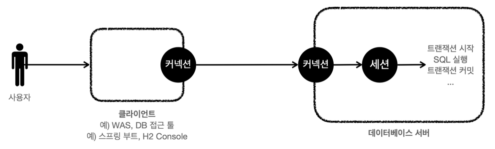
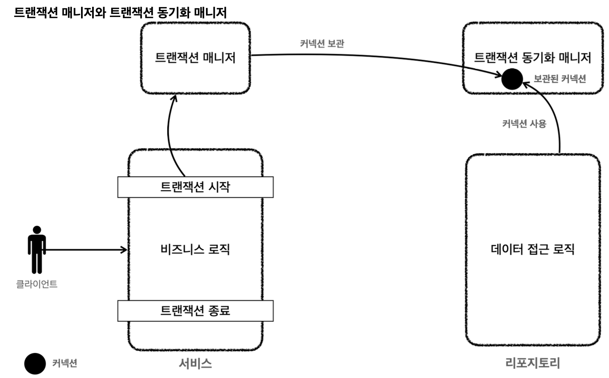

스프링이 제공하는 트랜잭션 매니저는 크게 두 가지 역할을 한다.
- 트랜잭션 추상화
- 리소스 동기화

#### 트랜잭션 추상화
트랜잭션 기술을 추상화 하는 부분은 이전 문서에 있다.

#### 리소스 동기화
트랜잭션을 유지하려면 트랜잭션의 시작부터 끝까지 같은 데이터베이스 커넥션을 유지해야 한다.
결국 같은 커넥션을 동기화하기 위해서 이전에는 파라미터로 커넥션을 전달하는 방법을 사용했다.
파라미터로 커넥션을 전달하는 방법은 코드가 지저분해지는 것은 물론이고, 커넥션을 넘기는 메서드와 넘기지 않는 메서드를 중복해서 만들어야 하는 등 여러가지 단점들이 많다.

- 스프링은 **트랜잭션 동기화 매니저**를 제공한다. 이것은 쓰레드 로컬(`Thread Local`)을 사용해서 커넥션을 동기화해준다.
	- 트랜잭션 매니저는 내부에서 이 트랜잭션 동기화 매니저를 사용한다.
- 트랜잭션 동기화 매니저는 쓰레드 로컬을 사용하기 때문에 멀티쓰레드 상황에서 안전하게 커넥션을 동기화 할 수 있다.
	- 따라서 커넥션이 필요하면 트랜잭션 동기화 매니저를 통해 커넥션을 획득하면 된다.
	- 따라서 이전처럼 파라미터로 커넥션을 전달하지 않아도 된다.

**동작 방식은 아래와 같다**
1. 트랜잭션을 시작하려면 커넥션이 필요하다. 트랜잭션 매니저는 데이터 소스를 통해 커넥션을 만들고 트랜잭션을 시작한다.
2. 트랜잭션 매니저는 트랜잭션이 시작된 커넥션을 트랜잭션 동기화 매니저에 보관한다.
3. 리포지토리는 트랜잭션 동기화 매니저에 보관된 커넥션을 꺼내서 사용한다. 따라서 파라미터로 커넥션을 전달하지 않아도 된다.
4. 트랜잭션이 종료되면 트랜잭션 매니저는 트랜잭션 동기화 매니저에 보관된 커넥션을 통해 트랜잭션을 종료하고, 커넥션도 닫는다.

**트랜잭션 동기화 매니저**
다음 트랜잭션 동기화 매니저 클래스를 열어보면 쓰레드 로컬을 사용하는 것을 확인할 수 있다.
`org.springframework.transaction.support.TransactionSynchronizationManager`

> 참고
> 쓰레드 로컬을 사용하면 각각의 쓰레드마다 별도의 저장소가 부여된다. 따라서 해당 쓰레드만 해당 데이터에 접근할 수 있다.
> 쓰레드 로컬에 대한 자세한 내용은 따로 찾아보자.

__출처: 인프런 김영한 지식공유자님의 강의 - 스프링 DB 1편__
