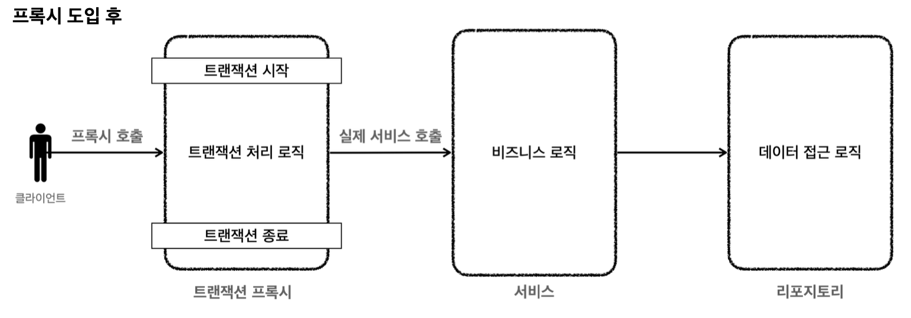

트랜잭션 AOP를 사용하는 새로운 서비스 클래스를 만들자.

**MemberServiceV3_3**
```java
package hello.jdbc.service;  
  
import hello.jdbc.domain.Member;  
import hello.jdbc.repository.MemberRepositoryV3;  
import java.sql.SQLException;  
import lombok.RequiredArgsConstructor;  
import lombok.extern.slf4j.Slf4j;  
import org.springframework.transaction.PlatformTransactionManager;  
import org.springframework.transaction.annotation.Transactional;  
import org.springframework.transaction.support.TransactionTemplate;  
  
/*  
* 트랜잭션 - @Transactional AOP
* */  
@Slf4j  
@RequiredArgsConstructor  
public class MemberServiceV3_3 {  
  
  private final MemberRepositoryV3 memberRepository;  
  
  @Transactional  
  public void accountTransfer(String fromId, String toId, int money) throws SQLException {  
    bizLogic(fromId, toId, money);  
  }  
  
  private void bizLogic(String fromId, String toId, int money) throws SQLException {  
    Member fromMember = memberRepository.findById(fromId);  
    Member toMember = memberRepository.findById(toId);  
  
    memberRepository.update(fromId, fromMember.getMoney() - money);  
    validation(toMember);  
    memberRepository.update(toId, toMember.getMoney() + money);  
  }  
  
  private void validation(Member toMember) {  
    if (toMember.getMemberId().equals("ex")) {  
      throw new IllegalStateException("이체 중 예외 발생");  
    }  
  }  
  
}
```

- 순수한 비즈니스 로직만 남기고, 트랜잭션 관련 코드는 모두 제거했다.
- 스프링이 제공하는 트랜잭션 AOP를 적용하기 위해 `@Transactional` 애노테이션을 추가했다.
- `@Transactional` 애노테이션은 메서드에 붙여도 되고, 클래스에 붙여도 된다.
	- 클래스에 붙이면 외부에서 호출 가능한 `public` 메서드가 AOP 적용 대상이 된다.

**MemberServiceV3_3Test**
```java
package hello.jdbc.service;  
  
import static hello.jdbc.connection.ConnectionConst.PASSWORD;  
import static hello.jdbc.connection.ConnectionConst.URL;  
import static hello.jdbc.connection.ConnectionConst.USER;  
import static org.assertj.core.api.Assertions.assertThat;  
import static org.assertj.core.api.Assertions.assertThatThrownBy;  
  
import hello.jdbc.domain.Member;  
import hello.jdbc.repository.MemberRepositoryV3;  
import java.sql.SQLException;  
import javax.sql.DataSource;  
import lombok.extern.slf4j.Slf4j;  
import org.assertj.core.api.Assertions;  
import org.junit.jupiter.api.AfterEach;  
import org.junit.jupiter.api.DisplayName;  
import org.junit.jupiter.api.Test;  
import org.springframework.aop.support.AopUtils;  
import org.springframework.beans.factory.annotation.Autowired;  
import org.springframework.boot.test.context.SpringBootTest;  
import org.springframework.boot.test.context.TestConfiguration;  
import org.springframework.context.annotation.Bean;  
import org.springframework.jdbc.datasource.DataSourceTransactionManager;  
import org.springframework.jdbc.datasource.DriverManagerDataSource;  
import org.springframework.transaction.PlatformTransactionManager;  
  
@Slf4j  
@SpringBootTest  
class MemberServiceV3_3Test {  
  
  public static final String MEMBER_A = "memberA";  
  public static final String MEMBER_B = "memberB";  
  public static final String MEMBER_EX = "ex";  
  
  @Autowired  
  private MemberRepositoryV3 memberRepository;  
  
  @Autowired  
  private MemberServiceV3_3 memberService;  
  
  @AfterEach  
  void after() throws SQLException {  
    memberRepository.delete(MEMBER_A);  
    memberRepository.delete(MEMBER_B);  
    memberRepository.delete(MEMBER_EX);  
  }  
  
  @TestConfiguration  
  static class TestConfig {  
    @Bean  
    DataSource dataSource() {  
      return new DriverManagerDataSource(URL, USER, PASSWORD);  
    }  
  
    @Bean  
    PlatformTransactionManager transactionManager() {  
      return new DataSourceTransactionManager(dataSource());  
    }  
  
    @Bean  
    MemberRepositoryV3 memberRepository() {  
      return new MemberRepositoryV3(dataSource());  
    }  
  
    @Bean  
    MemberServiceV3_3 memberService() {  
      return new MemberServiceV3_3(memberRepository());  
    }  
  }  
  
  @Test  
  void AopCheck() {  
    log.info("memberService class = {}", memberService.getClass());  
    log.info("memberRepository class = {}", memberRepository.getClass());  
    assertThat(AopUtils.isAopProxy(memberRepository)).isFalse();  
    assertThat(AopUtils.isAopProxy(memberService)).isTrue();  
  }  
  
  
  @Test  
  @DisplayName("정상 이체")  
  void accountTransfer() throws SQLException {  
    // given  
    Member memberA = new Member(MEMBER_A, 10000);  
    Member memberB = new Member(MEMBER_B, 10000);  
    memberRepository.save(memberA);  
    memberRepository.save(memberB);  
  
    // when  
    memberService.accountTransfer(memberA.getMemberId(), memberB.getMemberId(), 2000);  
  
    // then  
    Member findMemberA = memberRepository.findById(memberA.getMemberId());  
    Member findMemberB = memberRepository.findById(memberB.getMemberId());  
    assertThat(findMemberA.getMoney()).isEqualTo(8000);  
    assertThat(findMemberB.getMoney()).isEqualTo(12000);  
  }  
  
  @Test  
  @DisplayName("이체 중 예외 발생")  
  void accountTransferEx() throws SQLException {  
    // given  
    Member memberA = new Member(MEMBER_A, 10000);  
    Member memberEx = new Member(MEMBER_EX, 10000);  
    memberRepository.save(memberA);  
    memberRepository.save(memberEx);  
  
    // when  
    assertThatThrownBy(() -> memberService.accountTransfer(memberA.getMemberId(), memberEx.getMemberId(), 2000))  
        .isInstanceOf(IllegalStateException.class);  
  
    // then  
    Member findMemberA = memberRepository.findById(memberA.getMemberId());  
    Member findMemberEx = memberRepository.findById(memberEx.getMemberId());  
    assertThat(findMemberA.getMoney()).isEqualTo(10000);  
    assertThat(findMemberEx.getMoney()).isEqualTo(10000);  
  }  
  
}
```

- `@SpringBootTest`
	- 스프링 AOP를 적용하려면 스프링 컨테이너가 필요하다.
	- 이 애노테이션이 있으면 테스트 시 스프링 부트를 통해 스프링 컨테이너를 생성한다.
	- 때문에 테스트에서 `@Autowired` 등을 통해 스프링 컨테이너가 관리하는 빈들을 사용할 수 있다.
- `@TestConfiguration`
	- 테스트 안에서 내부 설정 클래스를 만들어서 사용하면서 이 에노테이션을 붙이면, 스프링 부트가 자동으로 만들어주는 빈들에 추가로 필요한 스프링 빈들을 등록하고 테스트를 수행할 수 있다.
- `TestConfig`
	- `DataSource` 스프링에서 기본으로 사용할 데이터소스를 스프링 빈으로 등록한다.
		- 추가로 트랜잭션 매니저에서도 사용한다.  
	- `DataSourceTransactionManager` 트랜잭션 매니저를 스프링 빈으로 등록한다.
		- 스프링이 제공하는 트랜잭션 AOP는 스프링 빈에 등록된 트랜잭션 매니저를 찾아서 사용하기 때문에 트랜잭션 매니저를 스프링 빈으로 등록해두어야 한다.
	- 해당 클래스를 통해 `Bean`으로 등록하는 이유는 `@Transactional`을 통해 트랜잭션을 적용하기 위해선, 해당 클래스들이 스프링의 빈으로 관리되어야 한다.
		- 때문에 의존관계 주입을 위해 `Bean`으로 등록을 하였다.

**실행 결과 - AopCheck()**
```java
memberService class = class hello.jdbc.service.MemberServiceV3_3$$SpringCGLIB$$0
memberRepository class = class hello.jdbc.repository.MemberRepositoryV3
```

- 먼저 AOP 프록시가 적용되었는지 확인해보자.
	- `AopCheck()`의 실행 결과를 보면 `memberService`에 `SpringCGLIB..`라는 부분을 통해 프록시(CGLIB)가 적용된 것을 확인할 수 있다.
	- `memberRepository` 에는 AOP를 적용하지 않았기 때문에 프록시가 적용되지 않는다.
		- AOP를 적용하지 않았다는 것 -> `@Transactionl`을 등록하지 않았다는 것
- 나머지 테스트 코드들을 실행해보면 트랜잭션이 정상 수행되고, 실패시 정상 롤백된 것을 확인할 수 있다.

**즉, `@Transactional` 도입 시 아래와 같은 형태의 구조로 변환이 되는 것이다.**



**트랜잭션 프록시 코드 예시**
```java
public class TransactionProxy {
	private MemberService proxy;
	
	public void logic() {
		// 트랜잭션 시작
		TransactionStatus status = transactionManager.getTransaction(..);
		try {
			//실제 대상 호출  
			target.logic();
			transactionManager.commit(status); //성공시 커밋
		} catch (Exception e) {
			transactionManager.rollback(status); //실패시 롤백
            throw new IllegalStateException(e);
		}
}
```

**트랜잭션 프록시 적용 후 서비스 코드 예시**
```java
public class Service {
	public void logic() {  
		//트랜잭션 관련 코드 제거, 순수 비즈니스 로직만 남음
		bizLogic(fromId, toId, money);
	} 
}
```


__출처: 인프런 김영한 지식공유자님의 강의 - 스프링 DB 1편__
