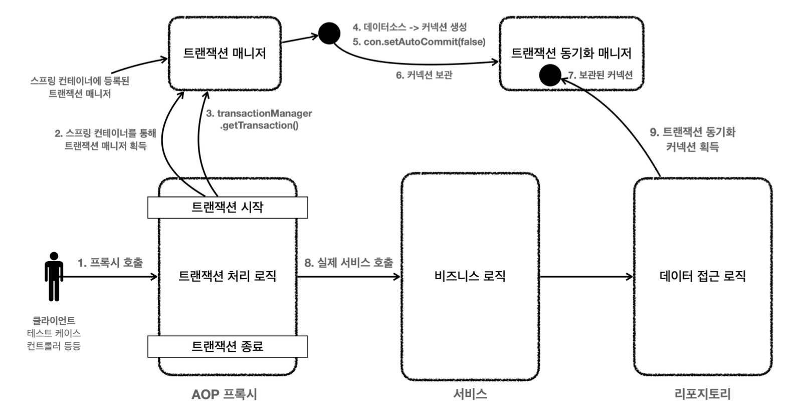

트랜잭션 AOP가 사용된 전체 흐름을 그림으로 정리해보자.



1. 클라이언트가 **서비스 프록시 객체**(이하 프록시) 호출
2. 프록시는 스프링 컨테이너에 등록된 트랜잭션 매니저를 통해 트랜잭션 매니저를 획득
3. 프록시 객체는 트랜잭션 매니저의 `getTransaction()`을 통해 트랜잭션 시작
4. 트랜잭션 매니저는 DataSource를 통해 커넥션 생성 수 수동 커밋 모드로 변경(수동 커밋 모드로 변경해야 트랜잭션 처리 가능)
	- 여기서 트랜잭션이란, 성공 실패 여부에 따라 커밋 혹은 롤백을 진행할 수 있도록 하는 것을 말함
5. 트랜잭션 매니저는 커넥션을 트랜잭션 동기화 매니저에 보관
6. 프록시는 실제 서비스 객체의 비즈니스 로직 호출
7. 비즈니스 로직은 데이터 접근 로직 실행
8. 데이터 접근 로직은 트랜잭션 동기화 매니저를 통해 보관된 커넥션 획득하여 작업

**데이터 접근 로직에서 커넥션을 반환받는 코드**
```java
private Connection getConnection() {  
  // 주의! 트랜잭션 동기화를 사용하려면 DataSourceUtils를 사용해야 한다.  
  Connection con = DataSourceUtils.getConnection(dataSource);  
  log.info("get connections = {} class = {}", con, con.getClass());  
  return con;  
}

public static Connection getConnection(DataSource dataSource) throws CannotGetJdbcConnectionException {  
  try {  
    return doGetConnection(dataSource);  
  }
  ...
}

public static Connection doGetConnection(DataSource dataSource) throws SQLException {  
  Assert.notNull(dataSource, "No DataSource specified");  
  ConnectionHolder conHolder = (ConnectionHolder)TransactionSynchronizationManager.getResource(dataSource);
  ...
}
```

#### 선언적 트랜잭션 관리 vs 프로그래밍 방식 트랜잭션 관리
- 선언적 트랜잭션 관리(Declarative Transaction Management)
	- `@Transactional` 애노테이션 하나만 선언해서 매우 편리하게 트랜잭션을 적용하는 것을 선언적 트랜잭션 관리라 한다.  
	- 선언적 트랜잭션 관리는 과거 XML에 설정하기도 했다.
	- 이름 그대로 해당 로직에 트랜잭션을 적용하겠다 라고 어딘가에 선언하기만 하면 트랜잭션이 적용되는 방식이다.
- 프로그래밍 방식의 트랜잭션 관리(programmatic transaction management)  
	- 트랜잭션 매니저 또는 트랜잭션 템플릿 등을 사용해서 트랜잭션 관련 코드를 직접 작성하는 것을 프로그래밍 방식의 트랜잭션 관리라 한다.

<hr>

- 선언적 트랜잭션 관리가 프로그래밍 방식에 비해서 훨씬 간편하고 실용적이기 때문에 실무에서는 대부분 선언적 트랜잭션 관리를 사용한다.  
- 프로그래밍 방식의 트랜잭션 관리는 스프링 컨테이너나 스프링 AOP 기술 없이 간단히 사용할 수 있지만 실무에서는 대부분 스프링 컨테이너와 스프링 AOP를 사용하기 때문에 거의 사용되지 않는다.
- 프로그래밍 방식 트랜잭션 관리는 테스트 시 가끔 사용될 때는 있다.

## 정리
- 스프링이 제공하는 선언적 트랜잭션 관리 덕분에 드디어 트랜잭션 관련 코드를 순수한 비즈니스 로직에서 제거할 수 있었다.
- 개발자는 트랜잭션이 필요한 곳에 `@Transactional` 애노테이션 하나만 추가하면 된다. 나머지는 스프링 트랜 잭션 AOP가 자동으로 처리해준다.
	- `@Transactional` 애노테이션의 자세한 사용법은 뒤에서 익히고, 지금은 전체 구조를 이해하는데 초점을 맞추자.


__출처: 인프런 김영한 지식공유자님의 강의 - 스프링 DB 1편__
