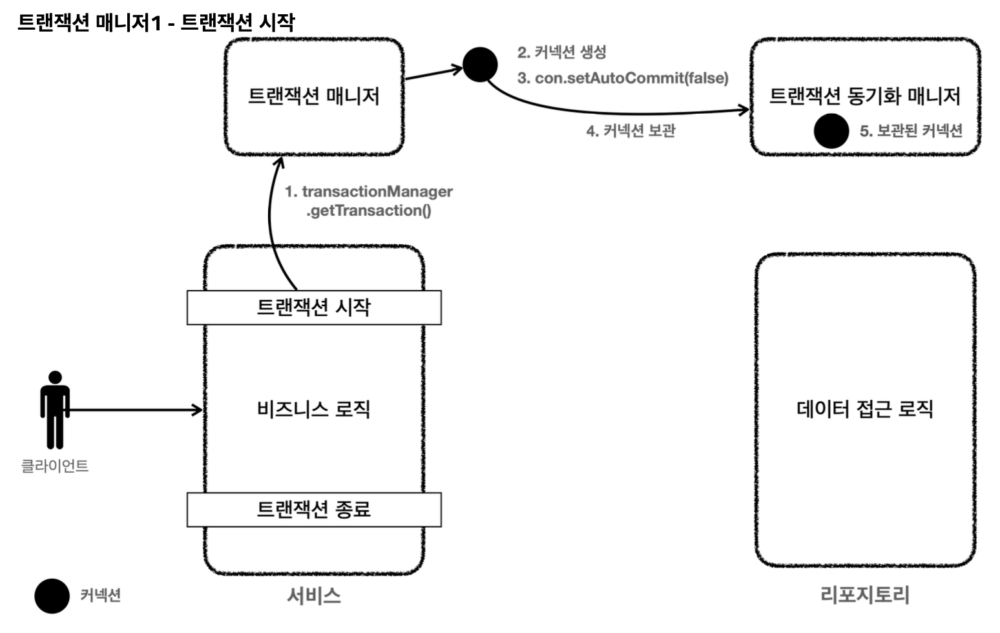
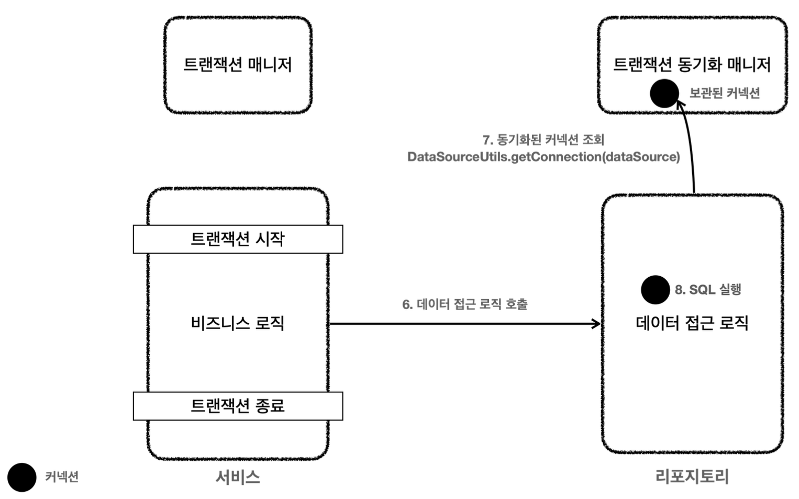
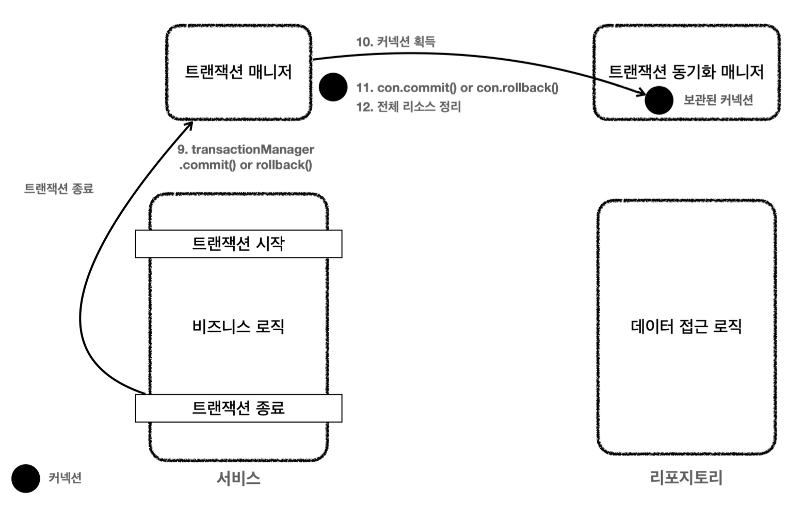

그림으로 트랜잭션 매니저의 전체 동작 흐름을 자세히 이해해보자.

클라이언트의 요청으로 서비스 로직을 실행한다.
1. 서비스 계층에서 `transactionManager.getTransaction()`을 호출해서 트랜잭션을 시작한다.
2. 트랜잭션을 시작하려면 먼저 데이터베이스 커넥션이 필요하다. 트랜잭션 매니저는 내부에서 데이터소스를 사용해서 커넥션을 생성한다.
3. 커넥션을 수동 커밋 모드로 변경해서 매니저에 보관한다.
4. 트랜잭션 동기화 매니저는 쓰레드 로컬에 커넥션을 보관한다. 따라서 멀티 쓰레드 환경에 안전하게 커넥션을 보관할 수 있다.

6. 서비스는 비즈니스 로직을 실행하면서 리포지토리의 메서드를 호출한다. 이때 커넥션을 파라미터로 전달하지 않는다.
7. 리포지토리 메서드들은 트랜잭션이 시작된 커넥션이 필요하다. 리포지토리는 `DataSourceUtils.getConnection()`을 사용해서 트랜잭션 동기화 매니저에 보관된 커넥션을 꺼내서 사용한다. 이 과정을 통해서 자연스럽게 같은 커넥션을 사용하고, 트랜잭션도 유지된다.
8. 획득한 커넥션을 사용해서 SQL을 데이터베이스에 전달해 실행한다.

9. 비즈니스 로직이 끝나고 트랜잭션을 종료한다. 트랜잭션은 커밋하거나 롤백하면 종료된다.
10. 트랜잭션을 종료하려면 동기화된 커넥션이 필요하다. 트랜잭션 동기화 매니저를 통해 동기화된 커넥션을 획득한다.
11. 획득한 커넥션을 통해 데이터베이스에 트랜잭션을 커밋하거나 롤백한다.
12. 전체 리소스를 정리한다.
	- 트랜잭션 동기화 매니저를 정리한다. 쓰레드 로컬은 사용 후 꼭 정리해야 한다.
	- `con.setAutoCommit(true)`로 되돌린다. 커넥션 풀을 고려해야 한다.
	- `con.close()`를 호출해서 커넥션을 종료한다. 커넥션 풀을 사용하는 경우 `con.close()`를 사용하면 커넥션 풀에 반환된다.

#### 정리
- 트랜잭션 추상화 덕분에 서비스 코드는 이제 JDBC 기술에 의존하지 않는다.
	- 이후 JDBC에서 JPA로 변경해도 서비스 코드를 그대로 유지할 수 있다.
	- 기술 변경시 의존관계 주입만 `DataSourceTransactionManager`에서 `JpaTransactionManager`로 변경해주면 된다.
	- `java.sql.SQLException`이 아직 남아있지만 이 부분은 뒤에 예외 문제에서 해결하자.
- 트랜잭션 동기화 매니저 덕분에 커넥션을 파라미터로 넘기지 않아도 된다.

> 참고
> 여기서는 `DataSourceTransactionManager`의 동작 방식을 설명한 것이다. 다른 트랜잭션 매니저는 해당 기술에 맞도록 변형되어 동작한다.

__출처: 인프런 김영한 지식공유자님의 강의 - 스프링 DB 1편__
