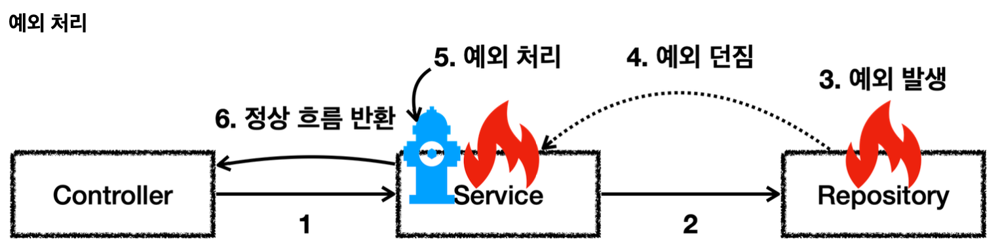
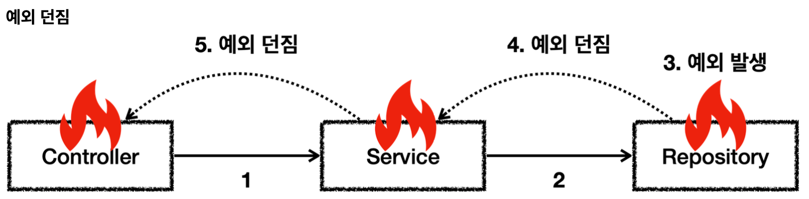

예외는 폭탄 돌리기와 같다. 잡아서 처리하거나, 처리할 수 없으면 밖으로 던져야한다.

- 5번에서 예외를 처리하면 이후에는 애플리케이션 로직이 정상 흐름으로 동작한다.

예외를 처리하지 못하면 호출한 곳으로 예외를 계속 던지게 된다.

#### 예외에 대해서는 2가지 기본 규칙을 기억하자.
1. 예외는 잡아서 처리하거나 던져야 한다.
2. 예외를 잡거나 던질 때 지정한 예외뿐만 아니라 그 예외의 자식들도 함께 처리된다.
	- 예를 들어서 `Exception`을 `catch`로 잡으면 그 하위 예외들도 모두 잡을 수 있다.
	- 예를 들어서 `Exception`을 `throws`로 던지면 그 하위 예외들도 모두 던질 수 있다.
    

#### 참고: 예외를 처리하지 못하고 계속 던지면 어떻게 될까?
자바 `main()` 쓰레드의 경우 예외 로그를 출력하면서 시스템이 종료된다.
웹 애플리케이션의 경우 여러 사용자의 요청을 처리하기 때문에 하나의 예외 때문에 시스템이 종료되면 안된다.
WAS가 해당 예외를 받아서 처리하는데, 주로 사용자에게 개발자가 지정한, 오류 페이지를 보여준다.

__출처: 인프런 김영한 지식공유자님의 강의 - 스프링 DB 1편__