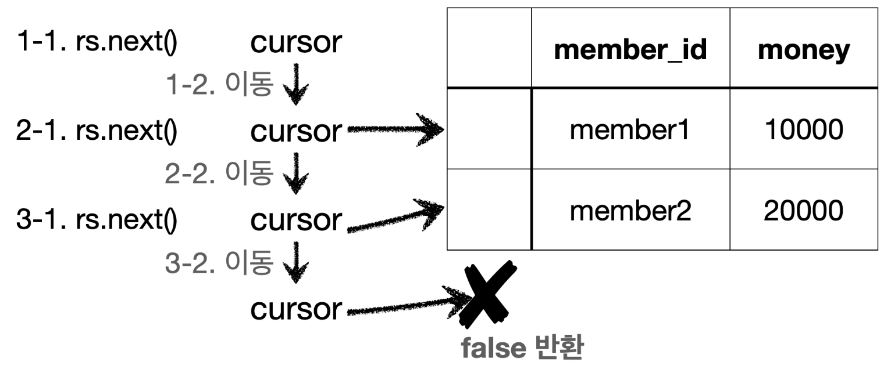

이번에는 JDBC를 통해 저장한 데이터를 조회하는 기능을 개발해보자.

__MemberRepositoryV0 - 회원 조회 추가__
```java
// 아래 코드 추가
import java.util.NoSuchElementException;

public Member findById(String memberId) throws SQLException {  
  String sql = "select * from member where member_id = ?";  
  
  Connection con = null;  
  PreparedStatement pstmt = null;  
  ResultSet rs = null;  
  
  try {  
    con = getConnection();  
    pstmt = con.prepareStatement(sql);  
    pstmt.setString(1, memberId);  
  
    rs = pstmt.executeQuery();  
  
    if (rs.next()) {  
      Member member = new Member();  
      member.setMemberId(rs.getString("member_id"));  
      member.setMoney(rs.getInt("money"));  
      return member;  
    } else {  
      throw new NoSuchElementException("member not found memberId = " + memberId);  
    }  
  } catch (SQLException e) {  
    log.error("db error", e);  
    throw e;  
  } finally {  
    close(con, pstmt, rs);  
  }  
}
```

__findById() - 쿼리 실행__
- `sql`: 데이터 조회를 위한 select SQL을 준비한다.
- `rs = pstmt.executeQuery()`: 데이터를 변경할 때는 `executeUpdate()`를 사용하지만, 데이터를 조회할 때는 `executeQuery()`를 사용한다.
	- `executeQuery()`는 결과를 `ResultSet`에 담아서 반환한다.

__executeQuery()__
```java
ResultSet executeQuery() throws SQLException;
```

__ResultSet__
- `ResultSet`은 다음과 같이 생긴 데이터 구조이다. 보통 select 쿼리의 결과가 순서대로 들어간다.
	- 예를 들어서 `select member_id, money` 라고 지정하면 `member_id` , `money` 라는 이름으로 데이터가 저장된다.  
	- 참고로 `select *` 을 사용하면 테이블의 모든 컬럼을 다 지정한다.
- `ResultSet`내부에 있는 커서(`cursor`)를 이동해서 다음 데이터를 조회할 수 있다.
- `rs.next()`: 이것을 호출하면 커서가 다음으로 이동한다. 참고로 최초의 커서는 데이터를 가리키고 있지 않기 때문에 `rs.next()`를 최초 한번은 호출해야 데이터를 조회할 수 있다.
	- `rs.next()`의 결과가 `true`면 커서의 이동 결과 데이터가 있다는 뜻이다.
	- `rs.next()`의 결과가 `false`면 더이상 커서가 가리키는 데이터가 없다는 뜻이다.
- `rs.getString("member_id")`: 현재 커서가 가리키고 있는 위치의 `member_id`데이터를 `String`타입 으로 반환한다.  
- `rs.getInt("money")`: 현재 커서가 가리키고 있는 위치의 `money`데이터를 `int`타입으로 반환한다.

__ResultSet 결과 예시__


참고로 이 `ResultSet`의 결과 예시는 회원이 2명 조회되는 경우이다.
- `1-1`에서 `rs.next()`를 호출한다.
- `1-2`의 결과로 `cursor`가 다음으로 이동한다. 이 경우 `cursor`가 가리키는 데이터가 있으므로 `true`를 반환
- `2-1`에서 `rs.netx()`를 호출한다.
- `2-2`의 결과로 `cursor`가 다음으로 이동한다. 이 경우 `cursor`가 가리키는 데이터가 있으므로 `true`를 반환
- `3-1`에서 `rs.next()`를 호출한다.
- `3-2`의 결과로 `cursor`가 다음으로 이동한다. 이 경우 `cursor`가 가리키는 데이터가 없으므로 `false`를 반환

__MemberRepositoryV0Test - 회원 조회 추가__
```java
package hello.jdbc.repository;  
  
import static org.assertj.core.api.Assertions.*;  
  
import hello.jdbc.domain.Member;  
import java.sql.SQLException;  
import lombok.extern.slf4j.Slf4j;  
import org.junit.jupiter.api.Test;  
  
@Slf4j  
class MemberRepositoryV0Test {  
  
  MemberRepositoryV0 repository = new MemberRepositoryV0();  
  
  @Test  
  void crud() throws SQLException {  
    // save  
    String memberId = "memberV2";  
    Member member = new Member(memberId, 10000);  
    repository.save(member);  
  
    // findById  
    Member findMember = repository.findById(memberId);  
    log.info("findMember = {}", findMember);  
    assertThat(findMember).isEqualTo(member);  
  }  
}
```

__실행 결과__
```
findMember = Member(memberId=memberV2, money=10000)
```
- 회원을 등록하고 그 결과를 바로 조회해서 확인했다.
- 참고로 실행 결과에 `member`객체의 참조 값이 아니라 실제 데이터가 보이는 이유는 롬복의 `@Data`가`toString()`을 적절히 오버라이딩 해서 보여주기 때문이다.
- `isEqualTo()`: `findMember.equals(member)`를 비교한다. 결과가 참인 이유는 롬복의 `@Data`는 해당 객체의 모든 필드를 사용하도록 `equals()`를 오버라이딩 하기 때문이다.


__출처: 인프런 김영한 지식공유자님의 강의 - 스프링 DB 1편__