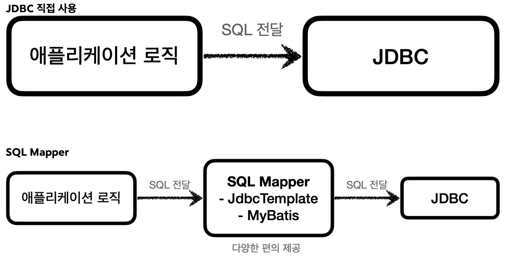
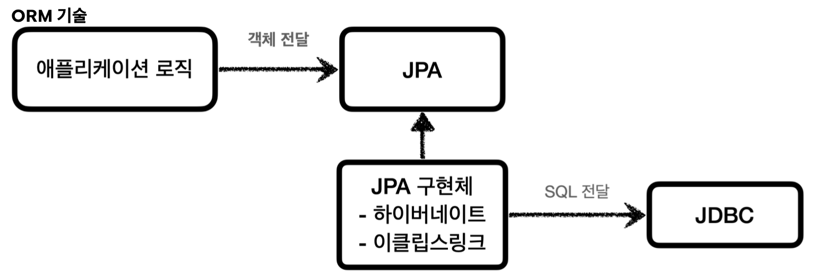

JDBC는 1997년에 출시될 정도로 오래된 기술이고, 사용하는 방법도 복잡하다. 그래서 최근에는 JDBC를 직접 사용하기 보다는 JDBC를 편리하게 사용하는 다양한 기술이 존재한다.
대표적으로 SQL Mapper와 ORM로 나눌 수 있다.

- SQL Mapper
	- 장점: JDBC를 편리하게 사용하도록 도와준다.
		- SQL 응답 결과를 객체로 편리하게 변환해준다.
		- JDBC의 반복 코드를 제거한다.
	- 단점: 개발자가 SQL을 직접 작성해야 한다.
	- 대표 기술: 스프링 Jdbc Template, MyBatis

- ORM 기술
	- ORM은 객체를 관계형 데이터베이스 테이블과 매핑해주는 기술이다.
	- 이 기술 덕분에 개발자는 반복적인 SQL을 직접 작성하지 않고, ORM 기술이 개발자 대신에 SQL을 동적으로 만들어 실행해준다.
	- 추가로 각각의 데이터베이스마다 다른 SQL을 사용하는 문제도 중간에서 해결해준다.
	- 대표 기술: JPA, Hibernate, EclipseLink
	- JPA는 자바 진영의 ORM 표준 인터페이스이고, 이것을 구현한 것으로 Hibernate와 EclipseLink 등의 구현 기술이 있다.

#### SQL Mapper vs ORM 기술
SQL Mapper와 ORM 기술 둘다 각각 장단점이 있다.
쉽게 설명하면 SQL Mapper는 SQL만 직접 작성하면 나머지 번거로운 일은 SQL Mapper가 대신 해결해준다.
SQL Mapper는 SQL만 작성할 줄 알면 금방 배워서 사용할 수 있다.
ORM기술은 SQL 자체를 작성하지 않아도 되어서 개발 생산성이 매우 높아진다.
편리한 반면에 쉬운 기술은 아니므로 실무에서 사용하려면 깊이있게 학습해야 한다.

물론 SQL Mapper와 ORM 모두 내부적으로는 JDBC를 사용하기 때문에, JDBC가 어떻게 동작하는지 기본 원리를 알아두어야 한다.
그래야 해당 기술들을 더 깊이있게 이해할 수 있고, 문제 발생 시 근본적인 문제를 찾아 해결할 수 있다.
__JDBC는 자바 개발자라면 꼭 알아두어야 하는 필수 기본 기술__ 이다.

__출처: 인프런 김영한 지식공유자님의 강의 - 스프링 DB 1편__
