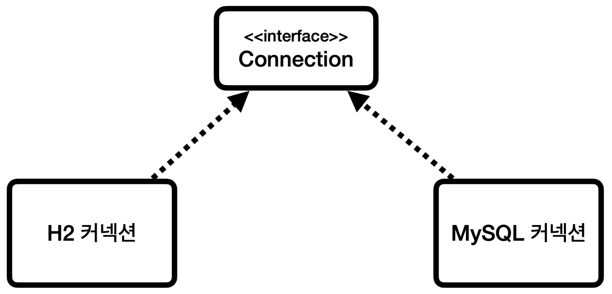
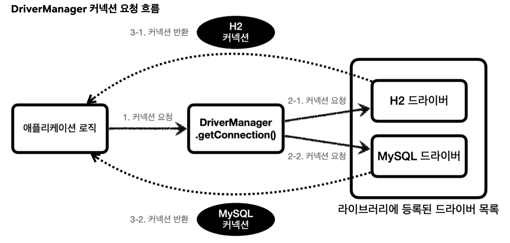

애플리케이션과 데이터베이스를 연결해보자.

__ConntectionConst__
```java
package hello.jdbc.connection;  
  
public abstract class ConnectionConst {  
  public static final String URL = "jdbc:h2:tcp://localhost/~/test";  
  public static final String USER = "sa";  
  public static final String PASSWORD = "test";  
}
```

데이터베이스에 접속하는데 필요한 기본 정보를 편리하게 사용할 수 있도록 상수로 만들었다.

이제 JDBC를 사용해서 실제 데이터베이스에 연결하는 코드를 작성해보자.

__DBConnectionUtil__
```java
package hello.jdbc.connection;  
  
import java.sql.Connection;  
import java.sql.DriverManager;  
import java.sql.SQLException;  
import lombok.extern.slf4j.Slf4j;  
  
import static hello.jdbc.connection.ConnectionConst.*;  
  
@Slf4j  
public class DBConnectionUtil {  
    
  public static Connection getConnection() {  
    try {  
      Connection connection = DriverManager.getConnection(URL, USER, PASSWORD);  
      log.info("get connection = {}, class = {}", connection, connection.getClass());  
      return connection;  
    } catch (SQLException e) {  
      throw new IllegalStateException(e);  
    }  
  }  
  
}
```

데이터베이스에 연결하려면 JDBC가 제공하는 `DriverManager.getConnection(..)`를 사용하면 된다.
이렇게 하면 라이브러리에 있는 데이터베이스 드라이버를 찾아서 해당 드라이버가 제공하는 커넥션을 반환해준다. 여기서는 H2 데이터베이스 드라이버가 작동해서 실제 데이터베이스와 커넥션을 맺고 그 결과를 반환해준다.

간단한 테스트 코드를 통해 실행해보자.

__DBConnectionUtilTest__
```java
package hello.jdbc.connection;  
  
import static org.assertj.core.api.Assertions.assertThat;  
  
import java.sql.Connection;  
import lombok.extern.slf4j.Slf4j;  
import org.junit.jupiter.api.Test;  
  
@Slf4j  
class DBConnectionUtilTest {  
  
  @Test  
  void connection() {  
    Connection connection = DBConnectionUtil.getConnection();  
    assertThat(connection).isNotNull();  
  }  
  
}
```

__실행 결과__
```
get connection = conn0: url=jdbc:h2:tcp://localhost/~/test user=SA, class = class org.h2.jdbc.JdbcConnection
```

실행 결과를 보면 `class = class org.h2.jdbc.JdbcConnection`를 확인할 수 있다.
이것이 바로 H2 데이터베이스 드라이버가 제공하는 H2 전용 커넥션이다. 
물론 이 커넥션은 JDBC 표준 커넥션 인터페이스인 `java.sql.Connection` 인터페이스를 구현하고 있다.

## JDBC DriverManager 연결 이해
지금까지 코드로 확인한 과정을 자세히 알아보자.

__JDBC 커넥션 인터페이스와 구현__

- JDBC는 `java.sql.Connection` 표준 커넥션 인터페이스를 정의한다.
- H2 데이터베이스 드라이버는 JDBC Connection 인터페이스를 구현한 `org.h2.jdbc.JdbcConnection` 구현체를 제공한다.


JDBC가 제공하는 `DriverManager`는 라이브러리에 등록된 DB 드라이버들을 관리하고, 커넥션을 획득하는 기능을 제공한다.
1. 애플리케이션 로직에서 커넥션이 필요하다면 `DriverManager.getConnection()`을 호출한다.
2. `DriverManager`는 라이브러리에 등록된 드라이버 목록을 자동으로 인식한다. 이 드라이버들에게 순서대로 다음 정보를 넘겨서 커넥션을 획들할 수 있는지 확인한다.
	- URL 예시: `jdbc:h2:tcp://localhost/~/test`
	- 이름, 비밀번호 등 접속에 필요한 추가 정보
	- 여기서 각각의 드라이버는 URL 정보를 체크해서 본인이 처리할 수 있는 요청인지 확인한다.
	- 예를 들어서 URL이 `jdbc:h2`로 시작하면 이것은 h2 데이터베이스에 접근하기 위한 규칙이다.
		- 따라서 H2 드라이버는 본인이 처리할 수 있으므로 실제 데이터베이스에 연결해서 커넥션을 획득하고 이 커넥션을 클라이언트에 반환한다.
		- 반면에 URL이 `jdbc:h2`로 시작했는데, MySQL 드라이버가 먼저 실행되면 이 경우 본인이 처리할 수 없다는 결과를 반환하게 되고, 다음 드라이버에게 순서가 넘어간다.
3. 이렇게 찾은 커넥션 구현체가 클라이언트에 반환된다.

현재 H2 데이터베이스 드라이버만 라이브러리에 등록했기 때문에 H2 드라이버가 제공하는 H2 커넥션을 제공받는다.
물론 이 H2 커넥션은 JDBC가 제공하는 `java.sql.Connection` 인터페이스를 구현하고 있다.


__출처: 인프런 김영한 지식공유자님의 강의 - 스프링 DB 1편__
