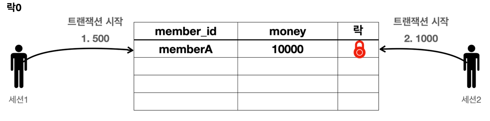
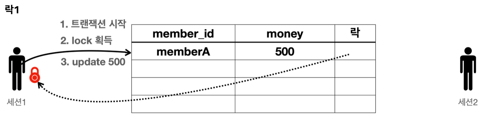
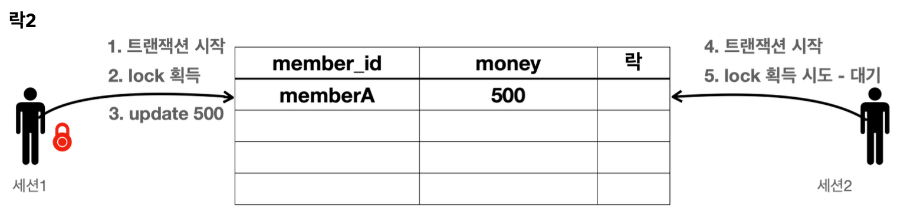
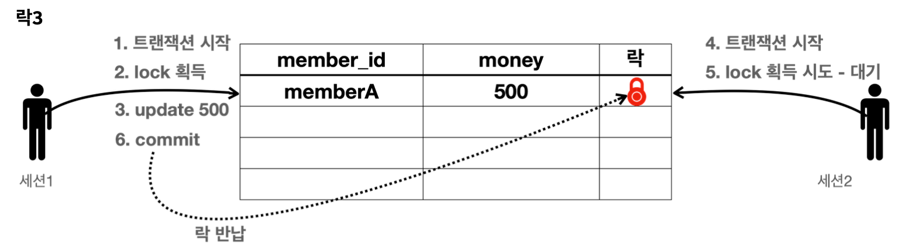
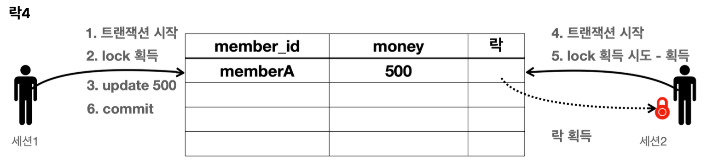
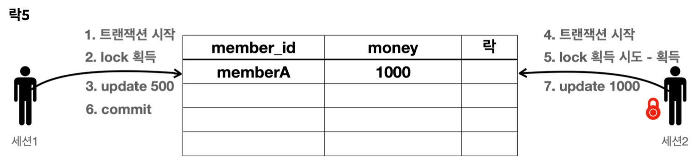
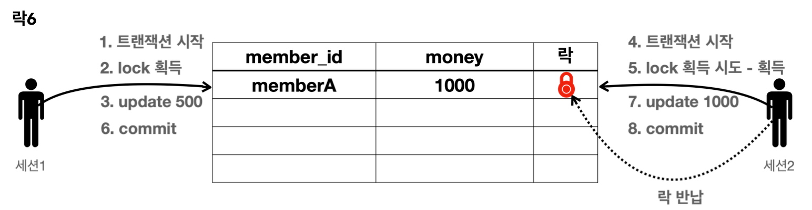

앞서 배운 내용을 실습해보자.


**기본 데이터 입력 - SQL**
```sql
set autocommit true;
delete from member;
insert into member(member_id, money) values ('memberA',10000);
```

#### 변경과 락


**세션 1**
```sql
set autocommit false;
update member set money=500 where member_id = 'memberA';
```
- 세션1이 트랜잭션을 시작하고, `memberA`의 데이터를 500원으로 업데이트 했다.
- 아직 커밋은 하지 않았다. `memberA` 로우의 락은 세션1이 가지게 된다.



**세션 2**
```sql
SET LOCK_TIMEOUT 60000;
set autocommit false;
update member set money=1000 where member_id = 'memberA';
```

- 세션2는 `memberA`의 데이터를 1000원으로 수정하려 한다.  
- 세션1이 트랜잭션을 커밋하거나 롤백해서 종료하지 않았으므로 아직 세션1이 락을 가지고 있다.
- 따라서 세션2는 락을 획득하지 못하기 때문에 데이터를 수정할 수 없다. 세션2는 락이 돌아올 때 까지 대기하게 된다.
- `SET LOCK_TIMEOUT 60000`: 락 획득 시간을 60초로 설정한다. 60초 안에 락을 얻지 못하면 예외가 발생한다.  
	- 참고로 H2 데이터베이스에서는 딱 60초에 예외가 발생하지는 않고, 시간이 조금 더 걸릴 수 있다.

**세션2 락 획득**
세션1을 커밋하면 세션1이 커밋되면서 락을 반납한다.
이후에 대기하던 세션2가 락을 획득하게 된다.
따라서 락을 획득한 세션2의 업데이트가 반영되는 것을 확인할 수 있다. 물론 이후에 세션2도 커밋을 호출해서 락을 반납해야 한다.


- 세션 1은 커밋을 수행한다. 커밋으로 트랜잭션이 종료되었으므로 락도 반납한다.

**세션 1**
```sql
commit;
```
세션1이 커밋하면 이후에 락을 반납하고 다음 시나리오가 이어진다.


- 락을 획득하기 위해 대기하던 세션2가 락을 획득한다.


- 세션2는 `update sql`을 정상 수행한다.


- 세션2는 커밋을 수행하고 트랜잭션이 종료되었으므로 락을 반납한다.

**세션 2**
```sql
commit;
```


## 세션2 락 타임아웃
- `SET LOCK_TIMEOUT <milliseconds>`: 락 타임아웃 시간을 설정한다.
	- 예) `SET LOCK_TIMEOUT 10000` 10초, 세션2에 설정하면 세션2가 10초 동안 대기해도 락을 얻지 못하면 락 타임아웃 오류가 발생한다.

이 시나리오 중간에 락을 오랜기간 대기하면 어떻게 되는지 알아보자.
10초 정도 기다리면 세션2에서는 다음과 같은 락 타임아웃 오류가 발생한다.

**세션2의 실행 결과**
```
Timeout trying to lock table {0}; SQL statement:
update member set money=10000 - 2000 where member_id = 'memberA' [50200-200]
HYT00/50200
```
세션1이 `memberA`의 데이터를 변경하고, 트랜잭션을 아직 커밋하지 않았다.
따라서 세션2는 세션1이 트랜잭션을 커밋하거나 롤백할 때 까지 대기해야 한다. 기다리면 락 타임아웃 오류가 발생하는 것을 확인할 수 있다.


__출처: 인프런 김영한 지식공유자님의 강의 - 스프링 DB 1편__

