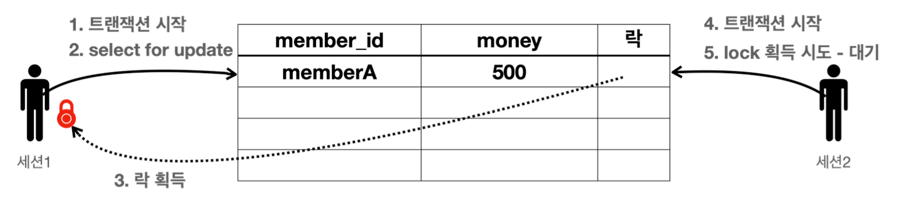

**일반적인 조회는 락을 사용하지 않는다**
- 데이터베이스마다 다르지만, 보통 데이터를 조회할 때는 락을 획득하지 않고 바로 데이터를 조회할 수 있다.
- 예를 들어서 세션1이 락을 획득하고 데이터를 변경하고 있어도, 세션2에서 데이터를 조회는 할 수 있다.
- 물론 세션2에서 조회가 아니라 데이터를 변경하려면 락이 필요하기 때문에 락이 돌아올 때 까지 대기해야 한다.

**조회와 락**
- 데이터를 조회할 때도 락을 획득하고 싶을 때가 있다.
- 이럴 때는 `select for update` 구문을 사용하면 된다.
	- 이렇게 하면 세션1이 조회 시점에 락을 가져가버리기 때문에 다른 세션에서 해당 데이터를 변경할 수 없다.
- 물론 이 경우도 트랜잭션을 커밋하면 락을 반납한다.

**조회 시점에 락이 필요한 경우는 언제일까?**
- 트랜잭션 종료 시점까지 해당 데이터를 다른 곳에서 변경하지 못하도록 강제로 막아야 할 때 사용한다.
- 예를 들어서 애플리케이션 로직에서 `memberA`의 금액을 조회한 다음에 이 금액 정보로 애플리케이션에서 어떤 계산을 수행한다.
- 그런데 이 계산이 돈과 관련된 매우 중요한 계산이어서 계산을 완료할 때 까지 `memberA`의 금액을 다른곳에서 변경하면 안된다.
- 이럴 때 조회 시점에 락을 획득하면 된다.



실습을 위해 데이터를 기본 데이터를 입력하자.

**기본 데이터 입력 - SQL**
```sql
set autocommit true;
delete from member;
insert into member(member_id, money) values ('memberA',10000);
```

**세션1**
```sql
set autocommit false;
select * from member where member_id='memberA' for update;
```

- `select for update` 구문을 사용하면 조회를 하면서 동시에 선택한 로우의 락도 획득한다.
- 물론 락이 없다면 락을 획득할 때 까지 대기해야 한다.  
- 세션1은 트랜잭션을 종료할 때 까지 `memberA`의 로우의 락을 보유한다.

**세션2**
```sql
set autocommit false;
update member set money=500 where member_id = 'memberA';
```
- 세션2는 데이터를 변경하고 싶다. 데이터를 변경하려면 락이 필요하다.  
- 세션1이 `memberA` 로우의 락을 획득했기 때문에 세션2는 락을 획득할 때 까지 대기한다.
- 이후에 세션1이 커밋을 수행하면 세션2가 락을 획득하고 데이터를 변경한다. 만약 락 타임아웃 시간이 지나면 락 타임아웃 예외가 발생한다.'

**세션1 커밋**
```sql
commit;
```

세션2도 커밋해서 데이터를 반영해준다.

**세션2 커밋**
```sql
commit;
```

## 정리
- 트랜잭션과 락은 데이터베이스마다 실제 동작하는 방식이 조금씩 다르기 때문에, 해당 데이터베이스 매뉴얼을 확인해보고, 의도한대로 동작하는지 테스트한 이후에 사용하자.

__출처: 인프런 김영한 지식공유자님의 강의 - 스프링 DB 1편__

