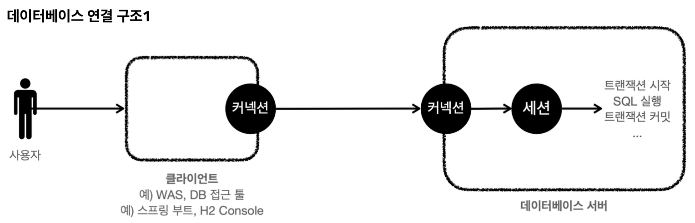
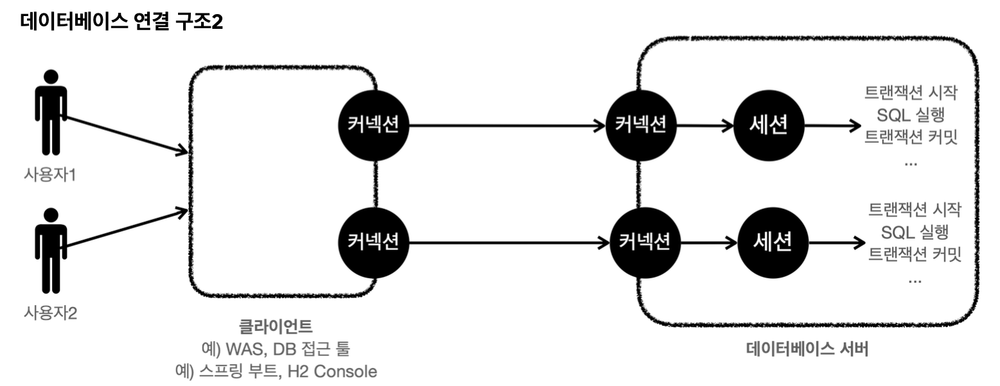

트랜잭션을 더 자세히 이해하기 위해 데이터베이스 서버 연결 구조와 DB 세션에 대해 알아보자.

- 사용자는 웹 애플리케이션 서버(WAS)나 DB 접근 툴 같은 클라이언트를 사용해서 데이터베이스 서버에 접근할 수 있다.
- 클라이언트는 데이터베이스 서버에 연결을 요청하고 커낵션을 맺게 된다.
- 이때 데이터베이스 서버는 내부에 세션이라는 것을 만든다.
- 앞으로 해당 커넥션을 통한 모든 요청은 이 세션을 통해 실행하게 된다.
- 쉽게 이야기하면 개발자가 클라이언트를 통해 SQL을 전달하면, 현재 커낵션에 세션이 SQL을 실행한다.
- 세션은 트랜잭션을 시작하고, 커밋 또는 롤백을 통해 트랜잭션을 종료한다. 그리고 이후에 새로운 트랜잭션을 다시 시작할 수 있다.
- 사용자가 커넥션을 닫거나, 또는 DBA(DB 관리자)가 세션을 강제로 종료하면 세션은 종료된다.

- 커넥션 풀이 10개의 커넥션을 생성하면, 세션도 10개 만들어진다.

__출처: 인프런 김영한 지식공유자님의 강의 - 스프링 DB 1편__