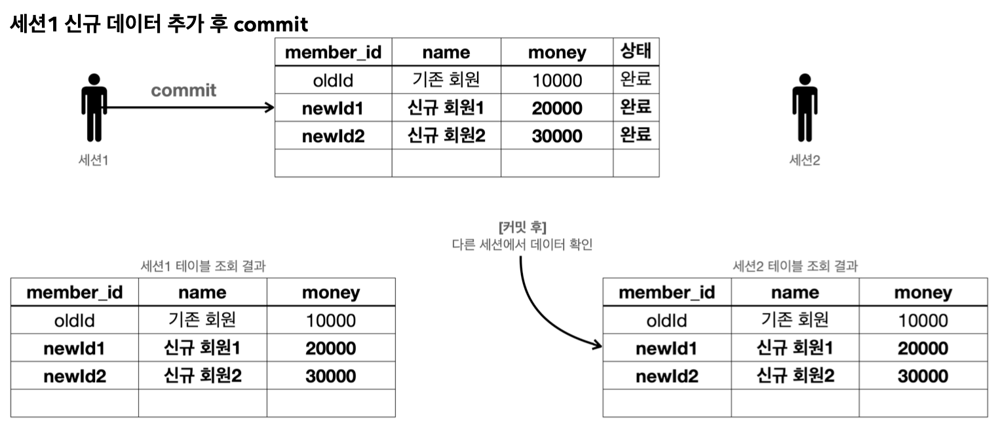

트랜잭션 동작을 예제를 통해 확인해보자.
먼저 트랜잭션의 동작 개념의 전체 그림을 이해하는데 집중한다.

> 참고
> 아래에 작성되는 내용은 트랜잭션 개념의 이해를 위해 예시로 드는 설명이다.
> 구체적인 실제 구현 방식은 데이터베이스 마다 다르다.

## 트랜잭션 사용법
- 데이터 변경 쿼리를 실행하고 데이터베이스에 그 결과를 반영하려면 커밋 명령어인 `commit`을 호출하고, 그 결과를 반영하고 싶지 않으면 롤백 명령어인 `rollback`을 호출하면 된다.
- **커밋을 호출하기 전까지는 임시로 데이터를 저장**하는 것이다. 따라서 해당 트랜잭션을 시작한 세션(사용자)에게만 변경 데이터가 보이고, 다른 세션(사용자)에게는 변경 데이터가 보이지 않는다.
- 등록, 수정, 삭제 모두 같은 원리로 동작한다. (이하 **변경**)

- `세션 1`, `세션 2` 모두 가운데 있는 기본 테이블을 조회하면 해당 데이터가 그대로 조회된다.

#### 세션 1 신규 데이터 추가

- 세션 1은 트랜잭션을 시작하고 신규 회원 1, 신규 회원 2를 DB에 추가했다. (아직 커밋 하지 않은 상태)
- 새로운 데이터는 임시 상태로 저장된다.
- 세션 1은 `select` 쿼리를 실행해서 본인이 입력한 신규 회원 1, 신규 회원 2를 조회할 수 있다.
- 세션 2는 `select`쿼리를 실행해도 신규 회원들을 조회할 수 없다.
	- 왜냐면 아직 세션 1이 커밋하지 않은 상태이기 때문이다.

#### 커밋하지 않은 데이터를 다른 곳에서 조회할 수 있으면 발생하는 문제점
- 예를 들어서 커밋하지 않는 데이터가 보인다면, 세션2는 데이터를 조회했을 때 신규 회원1, 2가 보일 것이다.
	- 따라서 신규 회원1, 신규 회원2가 있다고 가정하고 어떤 로직을 수행할 수 있다.
- 그런데 세션1이 롤백을 수행하면 신규 회원1, 신규 회원2의 데이터가 사라지게 된다.
	- 따라서 데이터 정합성에 큰 문제가 발생한다.  
- 세션2에서 세션1이 아직 커밋하지 않은 변경 데이터가 보인다면, 세션1이 롤백 했을 때 심각한 문제가 발생할 수 있다.
	- 따라서 커밋 전의 데이터는 다른 세션에서 보이지 않는다.

- 세션1이 신규 데이터를 추가한 후에 `commit`을 호출했다.  
- `commit`으로 새로운 데이터가 실제 데이터베이스에 반영된다. 데이터의 상태도 임시 -> 완료로 변경되었다.
- 이제 다른 세션에서도 회원 테이블을 조회하면 신규 회원들을 확인할 수 있다.

- 세션1이 신규 데이터를 추가한 후에 `commit` 대신에 `rollback`을 호출했다.
- 세션1이 데이터베이스에 반영한 모든 데이터가 처음 상태로 복구된다.
- 수정하거나 삭제한 데이터도 `rollback`을 호출하면 모든 트랜잭션을 시작하기 직전의 상태로 복구된다.

__출처: 인프런 김영한 지식공유자님의 강의 - 스프링 DB 1편__