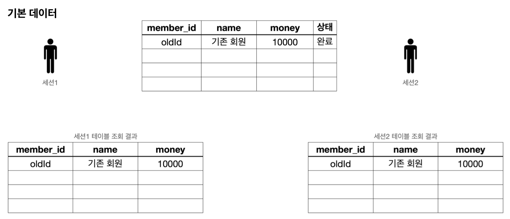
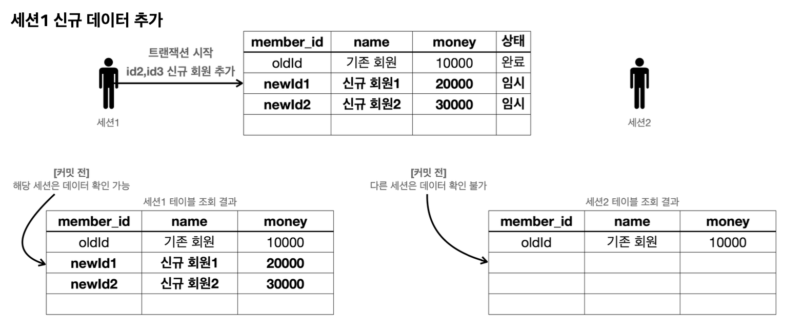
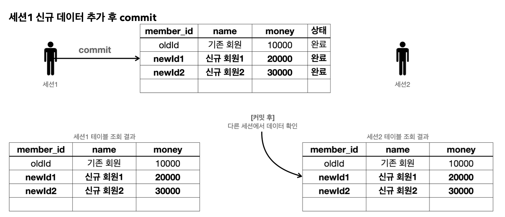
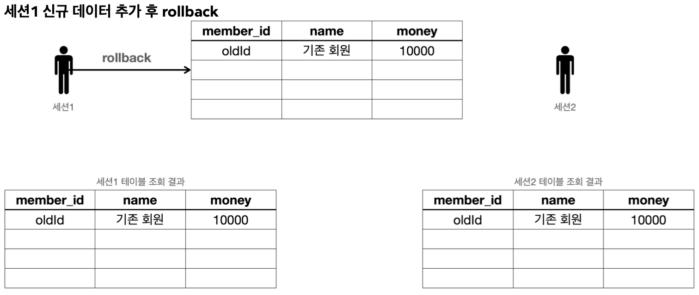

## 1. 기본 데이터 입력
먼저 기본 데이터를 다음과 같이 맞춰두자.



```sql
set autocommit true;
delete from member;
insert into member(member_id, money) values ('oldId',10000);
```
- 자동 커밋 모드를 사용했기 때문에 별도로 커밋을 호출하지 않아도 된다.

이렇게 데이터 초기화 후 세션1, 세션2에서 아래 쿼리를 실행하여 결과를 확인하자.
```sql
select * from member;
```
- 결과를 이미지와 비교하자. 참고로 이미지의 `name`필드는 이해를 돕기 위해 그린 것이고 실제로는 없다.

## 2. 신규 데이터 추가 - 커밋 전
세션1에서 신규 데이터를 추가해보자. 아직 커밋은 하지 않을 것이다.



__세션1 신규 데이터 추가  SQL__
```sql
//트랜잭션 시작
set autocommit false; //수동 커밋 모드
insert into member(member_id, money) values ('newId1',10000);
insert into member(member_id, money) values ('newId2',10000);
```

세션1, 세션2에서 다음 쿼리를 실행해서 결과를 확인하자.
```sql
select * from member;
```
결과를 이미지와 비교해보자. 아직 세션1이 커밋을 하지 않은 상태이기 때문에 세션1에서는 입력한 데이터가 보이지만, 세션2에서는 입력한 데이터가 보이지 않는 것을 확인할 수 있다.

## 3. 커밋 - commit
세션1에서 신규 데이터를 입력했는데, 아직 커밋은 하지 않았다. 이제 커밋해서 데이터베이스에 결과를 반영해보자.



세션1에서 커밋을 호출해보자. 
```sql
commit; //데이터베이스에 반영
```

세션1, 세션2에서 다음 쿼리를 실행해서 결과를 확인하자. 
```sql
select * from member;
```

결과를 이미지와 비교해보자. 세션1이 트랜잭션을 커밋했기 때문에 데이터베이스에 실제 데이터가 반영된다. 커밋 이후에는 모든 세션에서 데이터를 조회할 수 있다.

# 롤백 - rollback
이번에는 롤백에 대해서 알아보자.


예제를 처음으로 돌리기 위해 데이터를 초기화하자. 
```sql
//데이터 초기화  
set autocommit true;
delete from member;
insert into member(member_id, money) values ('oldId',10000);
```

#### 세션1 신규 데이터 추가 후

세션1에서 트랜잭션을 시작 상태로 만든 다음에 데이터를 추가하자.
```sql
//트랜잭션 시작
set autocommit false; //수동 커밋 모드
insert into member(member_id, money) values ('newId1',10000);
insert into member(member_id, money) values ('newId2',10000);
```

세션1, 세션2에서 다음 쿼리를 실행해서 결과를 확인하자. 
```sql
select * from member;
```
결과를 이미지와 비교해보자. 아직 세션1이 커밋을 하지 않은 상태이기 때문에 세션1에서는 입력한 데이터가 보이지만, 세션2에서는 입력한 데이터가 보이지 않는 것을 확인할 수 있다.



세션1에서 롤백을 호출해보자. 
```sql
rollback; //롤백으로 데이터베이스에 변경 사항을 반영하지 않는다.
```

세션1, 세션2에서 다음 쿼리를 실행해서 결과를 확인하자. 
```sql
select * from member;
```

결과를 이미지와 비교해보자. 롤백으로 데이터가 DB에 반영되지 않은 것을 확인할 수 있다.

__출처: 인프런 김영한 지식공유자님의 강의 - 스프링 DB 1편__
