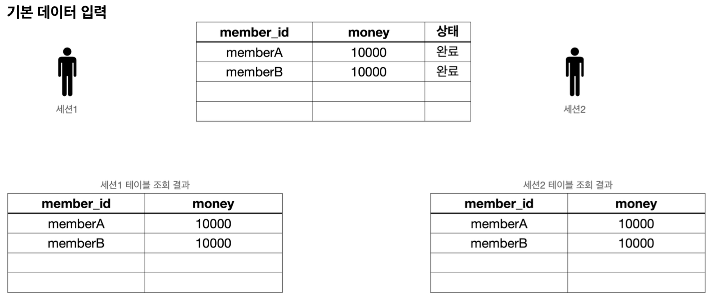
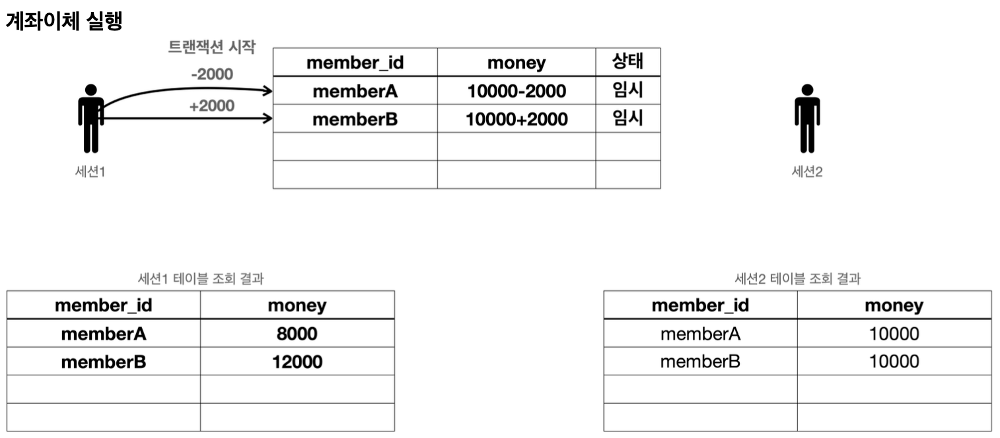
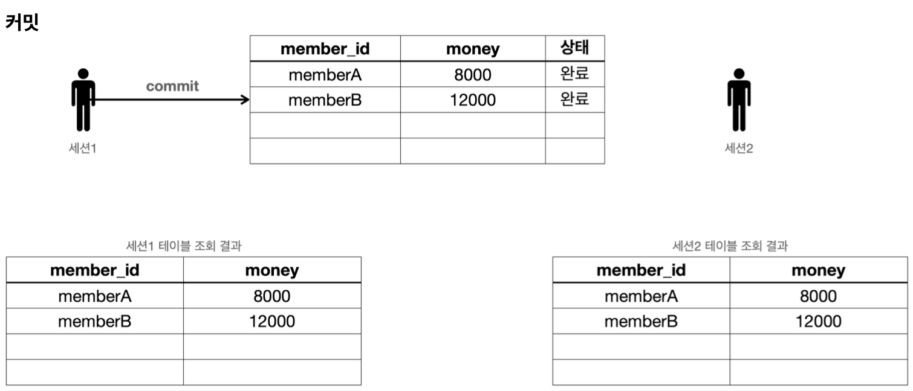
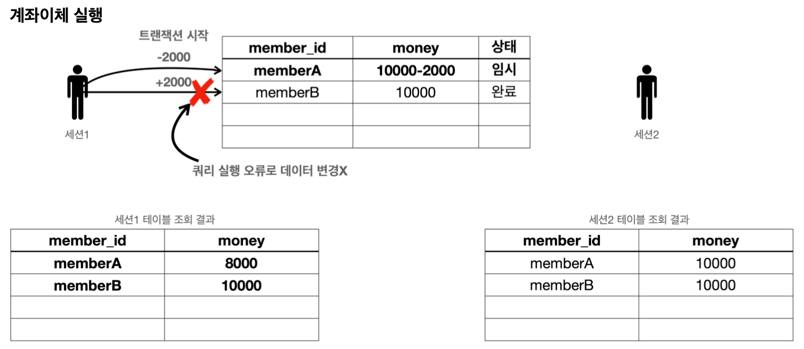
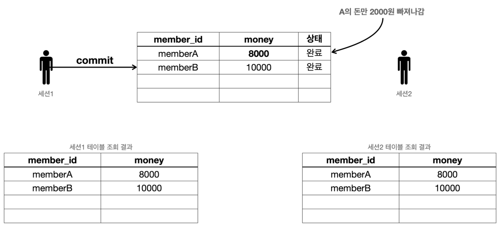
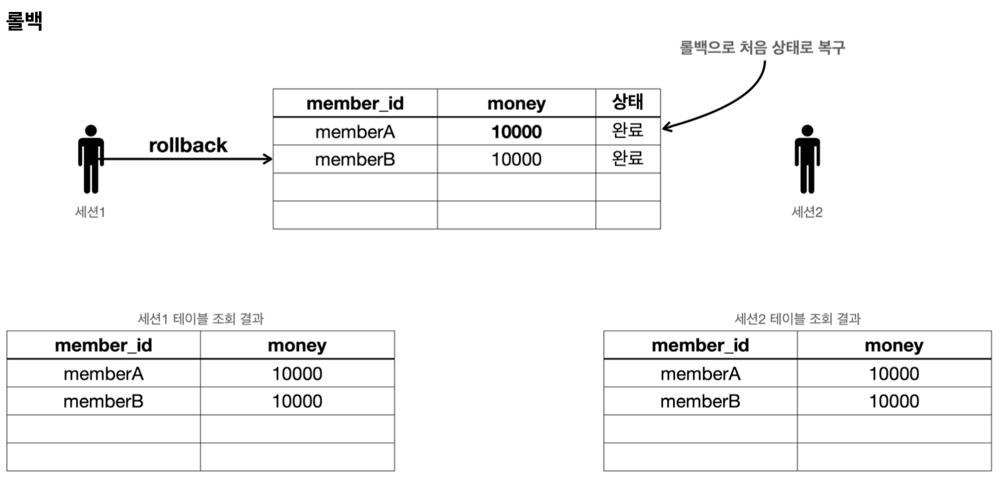

이번에는 계좌이체 예제를 통해 트랜잭션이 어떻게 사용되는지 조금 더 자세히 알아보자.

다음 3가지 상황이 있다.

- 계좌이체 정상  
- 계좌이체 문제 상황 - 커밋
- 계좌이체 문제 상황 - 롤백

### 계좌이체 정상
계좌이체가 발생하는 정상 흐름을 알아보자.



먼저 다음  SQL로 기본 데이터를 설정하자.
```sql
set autocommit true;
delete from member;
insert into member(member_id, money) values ('memberA',10000);
insert into member(member_id, money) values ('memberB',10000);
```
다음 기본 데이터를 준비했다.
- `memberA` 10000원
- `memberB` 10000원

이제 계좌이체를 실행해보자.

- `memberA`의 돈을 `memberB`에게 2000원 계좌이체하는 트랜잭션을 실행해보자.
- 다음과 같은 2번의 `update`쿼리가 수행되어야 한다.  
- `set autocommit false`로 설정한다.  
- 아직 커밋하지 않았으므로 다른 세션에는 기존 데이터가 조회된다.

**계좌이체 실행 SQL - 성공**
```sql
set autocommit false;
update member set money=10000 - 2000 where member_id = 'memberA';
update member set money=10000 + 2000 where member_id = 'memberB';
```


- `commit` 명령어를 실행하면 데이터베이스에 결과가 반영된다.  
- 다른 세션에서도 `memberA`의 금액이 8000원으로 줄어들고, `memberB`의 금액이 12000원으로 증가한 것을 확인할 수 있다.

**세션1 커밋**
```sql
commit;
```

__확인 쿼리__
```sql
select * from member;
```

### 계좌이체 문제 상황 - 커밋
이제 계좌이체 도중 문제가 발생하는 상황을 알아보자.

먼저 다음  SQL로 기본 데이터를 설정하자.
```sql
set autocommit true;
delete from member;
insert into member(member_id, money) values ('memberA',10000);
insert into member(member_id, money) values ('memberB',10000);
```


- 계좌이체를 실행하는 도중에 SQL에 문제가 발생한다.
	- 그래서 `memberA`의 돈을 2000원 줄이는 것에는 성공했지만, `memberB`의 돈을 2000원 증가시키는 것에 실패한다.
- 두 번째 SQL은 `member_iddd`라는 필드에 오타가 있다. 두 번째 update 쿼리를 실행하면 SQL 오류가 발생하는 것을 확인할 수 있다.

__계좌이체 실행 SQL - 오류__
```sql
set autocommit false;
update member set money=10000 - 2000 where member_id = 'memberA'; //성공
update member set money=10000 + 2000 where member_iddd = 'memberB'; //쿼리 예외 발생
```

**두 번째 SQL 실행시 발생하는 오류 메시지** 
```
Column "MEMBER_IDDD" not found; SQL statement:
update member set money=10000 + 2000 where member_iddd = 'memberB' [42122-200]
42S22/42122
```

여기서 문제는 `memberA`의 돈은 2000원 줄어들었지만, `memberB`의 돈은 2000원 증가하지 않았다는 점이다.
결과적으로 계좌이체는 실패하고 `memberA`의 돈만 2000원 줄어든 상황이다.

__강제 커밋__


만약 이 상황에서 강제로 `commit`을 호출하면 어떻게 될까?  
계좌이체는 실패하고 `memberA`의 돈만 2000원 줄어드는 아주 심각한 문제가 발생한다.

__세션1 커밋__
```sql
commit;
```

__확인 쿼리__
```sql
select * from member;
```

이렇게 중간에 문제가 발생했을 때는 커밋을 호출하면 안된다. 롤백을 호출해서 데이터를 트랜잭션 시작 시점으로 원복해야 한다.

### 계좌이체 문제 상황 - 롤백
중간에 문제가 발생했을 때 롤백을 호출해서 트랜잭션 시작 시점으로 데이터를 원복해보자.


먼저 다음  SQL로 기본 데이터를 설정하자.
```sql
set autocommit true;
delete from member;
insert into member(member_id, money) values ('memberA',10000);
insert into member(member_id, money) values ('memberB',10000);
```


- 계좌이체를 실행하는 도중에 SQL에 문제가 발생한다.
	- 그래서 `memberA`의 돈을 2000원 줄이는 것에는 성공했지만, `memberB`의 돈을 2000원 증가시키는 것에 실패한다.
- 두 번째 SQL은 `member_iddd`라는 필드에 오타가 있다. 두 번째 update 쿼리를 실행하면 SQL 오류가 발생하는 것을 확인할 수 있다.

__계좌이체 실행 SQL - 오류__
```sql
set autocommit false;
update member set money=10000 - 2000 where member_id = 'memberA'; //성공
update member set money=10000 + 2000 where member_iddd = 'memberB'; //쿼리 예외 발생
```

**두 번째 SQL 실행시 발생하는 오류 메시지** 
```
Column "MEMBER_IDDD" not found; SQL statement:
update member set money=10000 + 2000 where member_iddd = 'memberB' [42122-200]
42S22/42122
```

여기서 문제는 `memberA`의 돈은 2000원 줄어들었지만, `memberB`의 돈은 2000원 증가하지 않았다는 점이다.
결과적으로 계좌이체는 실패하고 `memberA`의 돈만 2000원 줄어든 상황이다.



이럴 때는 롤백을 호출해서 트랜잭션을 시작하기 전 단계로 데이터를 복구해야 한다.
롤백을 사용한 덕분에 계좌이체를 실행하기 전 상태로 돌아왔다.
`memberA`의 돈도 이전 상태인 10000원으로 돌아오고, `memberB`의 돈도 10000원으로 유지되는 것을 확인할 수 있다.

__세션1 - 롤백__
```sql
rollback;
```

## 정리
- **원자성**
	- 트랜잭션 내에서 실행한 작업들은 마치 하나의 작업인 것처럼 모두 성공 하거나 모두 실패해야 한다.
	- 트랜잭션의 원자성 덕분에 여러 SQL 명령어를 마치 하나의 작업인 것 처럼 처리할 수 있었다.
	- 성공하면 한번에 반영하고, 중간에 실패해도 마치 하나의 작업을 되돌리는 것 처럼 간단히 되돌릴 수 있다.

- **오토 커밋**
	- 만약 오토 커밋 모드로 동작하는데, 계좌이체 중간에 실패하면 어떻게 될까?
	- 쿼리를 하나 실행할 때 마다 바로바로 커밋이 되어버리기 때문에 `memberA`의 돈만 2000원 줄어드는 심각한 문제가 발생한다.
- **트랜잭션 시작**
	- 따라서 이런 종류의 작업은 꼭 수동 커밋 모드를 사용해서 수동으로 커밋, 롤백 할 수 있도록 해야 한다.
	- 보통 이렇게 자동 커밋 모드에서 수동 커밋 모드로 전환 하는 것을 트랜잭션을 시작한다고 표현한다.


__출처: 인프런 김영한 지식공유자님의 강의 - 스프링 DB 1편__
