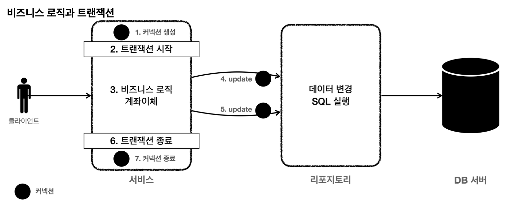
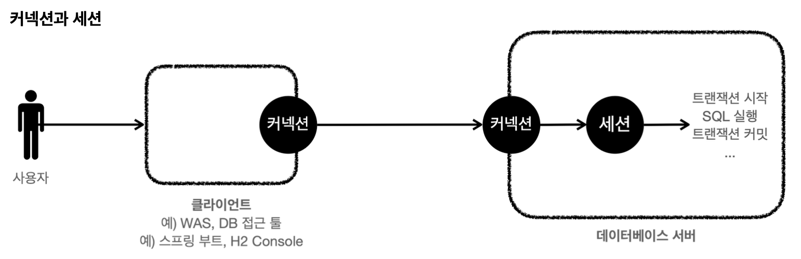

- 이번에는 DB 트랜잭션을 사용해서 앞서 발생한 문제점을 해결해보자.  
- 애플리케이션에서 트랜잭션을 어떤 계층에 걸어야 할까? 쉽게 이야기해서 트랜잭션을 어디에서 시작하고, 어디에서 커밋해야할까?


- 트랜잭션은 비즈니스 로직이 있는 서비스 계층에서 시작해야 한다.
- 비즈니스 로직이 잘못되면 해당 비즈니스 로직으로 인해 문제가 되는 부분을 함께 롤백해야 하기 때문이다.
- 그런데 트랜잭션을 시작하려면 커넥션이 필요하다. 결국 서비스 계층에서 커넥션을 만들고, 트랜잭션 커밋 이후에 커넥션을 종료해야 한다.
- 애플리케이션에서 DB 트랜잭션을 사용하려면 **트랜잭션을 사용하는 동안 같은 커넥션을 유지**해야한다. 그래야 같은 세션을 사용할 수 있다.


애플리케이션에서 같은 커넥션을 유지하려면 어떻게 해야할까? 가장 단순한 방법은 커넥션을 파라미터로 전달해서 같은 커넥션이 사용되도록 유지하는 것이다.
먼저 리포지토리가 파라미터를 통해 같은 커넥션을 유지할 수 있도록 파라미터를 추가하자.
코드 유지를 위해 `MemberRepositoryV1`은 남겨두고 `MemberRepositoryV2`를 만들자.

**MemberServiceV2**
```java
package hello.jdbc.repository;  
  
import hello.jdbc.domain.Member;  
import java.sql.Connection;  
import java.sql.PreparedStatement;  
import java.sql.ResultSet;  
import java.sql.SQLException;  
import java.sql.Statement;  
import java.util.NoSuchElementException;  
import javax.sql.DataSource;  
import lombok.extern.slf4j.Slf4j;  
import org.springframework.jdbc.support.JdbcUtils;  
  
/*  
* JDBC - ConnectionParam  
* */  
@Slf4j  
public class MemberRepositoryV2 {  
  
  private final DataSource dataSource;  
  
  public MemberRepositoryV2(DataSource dataSource) {  
    this.dataSource = dataSource;  
  }  
  
  public Member save(Member member) throws SQLException {  
    String sql = "insert into member(member_id, money) values(?, ?)";  
  
    Connection con = null;  
    PreparedStatement pstmt = null;  
  
    try {  
      con = getConnection();  
      pstmt = con.prepareStatement(sql);  
      pstmt.setString(1, member.getMemberId());  
      pstmt.setInt(2, member.getMoney());  
      pstmt.executeUpdate();  
      return member;  
    } catch (SQLException e) {  
      log.error("db error", e);  
      throw e;  
    } finally {  
      close(con, pstmt, null);  
    }  
  }  
  
  public Member findById(String memberId) throws SQLException {  
    String sql = "select * from member where member_id = ?";  
  
    Connection con = null;  
    PreparedStatement pstmt = null;  
    ResultSet rs = null;  
  
    try {  
      con = getConnection();  
      pstmt = con.prepareStatement(sql);  
      pstmt.setString(1, memberId);  
  
      rs = pstmt.executeQuery();  
  
      if (rs.next()) {  
        Member member = new Member();  
        member.setMemberId(rs.getString("member_id"));  
        member.setMoney(rs.getInt("money"));  
        return member;  
      } else {  
        throw new NoSuchElementException("member not found memberId = " + memberId);  
      }  
    } catch (SQLException e) {  
      log.error("db error", e);  
      throw e;  
    } finally {  
      close(con, pstmt, rs);  
    }  
  }  
  
  public Member findById(Connection con, String memberId) throws SQLException {  
    String sql = "select * from member where member_id = ?";  
  
    PreparedStatement pstmt = null;  
    ResultSet rs = null;  
  
    try {  
      pstmt = con.prepareStatement(sql);  
      pstmt.setString(1, memberId);  
  
      rs = pstmt.executeQuery();  
  
      if (rs.next()) {  
        Member member = new Member();  
        member.setMemberId(rs.getString("member_id"));  
        member.setMoney(rs.getInt("money"));  
        return member;  
      } else {  
        throw new NoSuchElementException("member not found memberId = " + memberId);  
      }  
    } catch (SQLException e) {  
      log.error("db error", e);  
      throw e;  
    } finally {  
      // connection은 여기서 닫지 않는다.  
      JdbcUtils.closeResultSet(rs);  
      JdbcUtils.closeStatement(pstmt);  
    }  
  }  
  
  public void update(String memberId, int money) throws SQLException {  
    String sql = "update member set money = ? where member_id = ?";  
  
    Connection con = null;  
    PreparedStatement pstmt = null;  
  
    try {  
      con = getConnection();  
      pstmt = con.prepareStatement(sql);  
      pstmt.setInt(1, money);  
      pstmt.setString(2, memberId);  
      int resultSize = pstmt.executeUpdate();  
      log.info("resultSize = {}", resultSize);  
    } catch (SQLException e) {  
      log.error("db error", e);  
      throw e;  
    } finally {  
      close(con, pstmt, null);  
    }  
  }  
  
  public void update(Connection con, String memberId, int money) throws SQLException {  
    String sql = "update member set money = ? where member_id = ?";  
  
    PreparedStatement pstmt = null;  
  
    try {  
      pstmt = con.prepareStatement(sql);  
      pstmt.setInt(1, money);  
      pstmt.setString(2, memberId);  
      int resultSize = pstmt.executeUpdate();  
      log.info("resultSize = {}", resultSize);  
    } catch (SQLException e) {  
      log.error("db error", e);  
      throw e;  
    } finally {  
      // connection은 여기서 닫지 않는다.  
      JdbcUtils.closeStatement(pstmt);  
    }  
  }  
  
  public void delete(String memberId) throws SQLException {  
    String sql = "delete from member where member_id = ?";  
  
    Connection con = null;  
    PreparedStatement pstmt = null;  
  
    try {  
      con = getConnection();  
      pstmt = con.prepareStatement(sql);  
      pstmt.setString(1, memberId);  
  
      pstmt.executeUpdate();  
    } catch (SQLException e) {  
      log.error("db error", e);  
      throw e;  
    } finally {  
      close(con, pstmt, null);  
    }  
  }  
  
  private void close(Connection con, Statement stmt, ResultSet rs) {  
    JdbcUtils.closeResultSet(rs);  
    JdbcUtils.closeStatement(stmt);  
    JdbcUtils.closeConnection(con);  
  }  
  private Connection getConnection() throws SQLException {  
    Connection con = dataSource.getConnection();  
    log.info("get connection = {}, class = {}", con, con.getClass());  
    return con;  
  }  
  
}
```
`MemberRepositoryV2`는 기존 코드와 같고 커넥션 유지가 필요한 다음 두 메서드가 추가되었다. 참고로 다음 두 메서드는 계좌이체 서비스 로직에서 호출하는 메서드이다.
- `findById(Connection con, String memberId)`
- `update(Connection con, String memberId, int money)`

**주의 - 코드에서 다음 부분을 주의해서 보자!**
1. 커넥션 유지가 필요한 두 메서드는 파라미터로 넘어온 커넥션을 사용해야 한다. 따라서 `con = getConnection()` 코드가 있으면 안된다.
2. 커넥션 유지가 필요한 두 메서드는 리포지토리에서 커넥션을 닫으면 안된다. 커넥션을 전달 받은 리포지토리 뿐만 아니라 이후에도 커넥션을 계속 이어서 사용하기 때문이다. 이후 서비스 로직이 끝날 때 트랜잭션을 종료하고 닫아야 한다.

이제 가장 중요한 트랜잭션 연동 로직을 작성해보자.

기존 `MemberServiceV1`을 복사해서 `MemberServiceV2`를 만들고 수정하자.

**MemberServiceV2**
```java
package hello.jdbc.service;  
  
import hello.jdbc.domain.Member;  
import hello.jdbc.repository.MemberRepositoryV2;  
import java.sql.Connection;  
import java.sql.SQLException;  
import javax.sql.DataSource;  
import lombok.RequiredArgsConstructor;  
import lombok.extern.slf4j.Slf4j;  
  
/*  
* 트랜잭션 - 파라미터 연동, 풀을 고려한 종료  
* */  
@Slf4j  
@RequiredArgsConstructor  
public class MemberServiceV2 {  
  
  private final DataSource dataSource;  
  private final MemberRepositoryV2 memberRepositoryV2;  
  
  public void accountTransfer(String fromId, String toId, int money) throws SQLException {  
    Connection con = dataSource.getConnection();  
  
    try {  
      con.setAutoCommit(false); // 트랜잭션 시작  
      // 비즈니스 로직      
      bizLogic(con, fromId, toId, money);  
      con.commit(); // 성공 시 커밋  
    } catch (Exception e) {  
      con.rollback(); // 실패 시 롤백  
      throw new IllegalStateException(e);  
    } finally {  
      release(con);  
    }  
  }  
  
  private void bizLogic(Connection con, String fromId, String toId, int money) throws SQLException {  
    Member fromMember = memberRepositoryV2.findById(con, fromId);  
    Member toMember = memberRepositoryV2.findById(con, toId);  
  
    memberRepositoryV2.update(con, fromId, fromMember.getMoney() - money);  
    validation(toMember);  
    memberRepositoryV2.update(con, toId, toMember.getMoney() + money);  
  }  
  
  private void validation(Member toMember) {  
    if (toMember.getMemberId().equals("ex")) {  
      throw new IllegalStateException("이체 중 예외 발생");  
    }  
  }  
  
  private void release(Connection con) throws SQLException {  
    if (con != null) {  
      try {  
        con.setAutoCommit(true); // 커넥션 풀 고려  
        con.close();  
      } catch (Exception e) {  
        log.info("error", e);  
      }  
    }  
  }  
  
}
```

- `Connection con = dataSource.getConnection();`
	- 트랜잭션을 시작하려면 커넥션이 필요하다.
- `con.setAutoCommit(false); // 트랜잭션 시작`
	- 트랜잭션을 시작하려면 자동 커밋 모드를 꺼야한다.
	- 이렇게 하면 커넥션을 통해 세션에 `set autocommit false`가 전달되고, 이후부터는 수동 커밋 모드로 동작한다.
	- 이렇게 자동 커밋 모드를 수동 커밋 모드로 변경하는 것을 트랜잭션을 시작한다고 보통 표현한다.
- `bizLogic(con, fromId, toId, money)`
	- 트랜잭션이 시작된 커넥션을 전달하면서 비즈니스 로직을 수행한다.
	- 이렇게 분리한 이유는 트랜잭션을 관리하는 로직과 실제 비즈니스 로직을 구분하기 위함이다.
	- `memberRepositoryV2.update(con..)`: 비즈니스 로직을 보면 리포지토리를 호출할 때 커넥션을 전달하는 것을 확인할 수 있다.
- `con.commit(); // 성공 시 커밋`
	- 비즈니스 로직이 정상 수행되면 트랜잭션을 커밋한다.
- `con.rollback(); // 실패 시 롤백`
	- `catch(Ex) {..}`를 사용해서 비즈니스 로직 수행 도중 예외가 발생할 경우 트랜잭션을 롤백한다.
- `release(con);`
	- `finally {..}`를 사용해서 커넥션을 모두 사용하고 나면 안전하게 종료한다.
	- 그런데 커넥션 풀을 사용하면 `con.close()`를 호출했을 때 커넥션이 종료되는 것이 아니라 풀에 반납된다.
	- 현재 수동 커밋 모드로 동작하기 때문에 풀에 돌려주기 전에 기본 값인 자동 커밋 모드로 변경하는 것이 안전하다.

**MemberServiceV2Test**
```java
package hello.jdbc.service;  
  
import static hello.jdbc.connection.ConnectionConst.PASSWORD;  
import static hello.jdbc.connection.ConnectionConst.URL;  
import static hello.jdbc.connection.ConnectionConst.USER;  
import static org.assertj.core.api.Assertions.assertThat;  
import static org.assertj.core.api.Assertions.assertThatThrownBy;  
  
import hello.jdbc.domain.Member;  
import hello.jdbc.repository.MemberRepositoryV2;  
import java.sql.SQLException;  
import org.junit.jupiter.api.AfterEach;  
import org.junit.jupiter.api.BeforeEach;  
import org.junit.jupiter.api.DisplayName;  
import org.junit.jupiter.api.Test;  
import org.springframework.jdbc.datasource.DriverManagerDataSource;  
  
/*  
* 트랜잭션 - 커넥션 파라미터 전달 방식 동기화  
* */  
class MemberServiceV2Test {  
  
  private MemberRepositoryV2 memberRepository;  
  private MemberServiceV2 memberService;  
  
  @BeforeEach  
  void before() {  
    DriverManagerDataSource dataSource = new DriverManagerDataSource(URL, USER, PASSWORD);  
    memberRepository = new MemberRepositoryV2(dataSource);  
    memberService = new MemberServiceV2(dataSource, memberRepository);  
  }  
  
  @AfterEach  
  void after() throws SQLException {  
    memberRepository.delete("memberA");  
    memberRepository.delete("memberB");  
    memberRepository.delete("ex");  
  }  
  
  @Test  
  @DisplayName("정상 예제")  
  void accountTransfer() throws SQLException {  
    // given  
    Member memberA = new Member("memberA", 10000);  
    Member memberB = new Member("memberB", 10000);  
    memberRepository.save(memberA);  
    memberRepository.save(memberB);  
  
    // when  
    memberService.accountTransfer(memberA.getMemberId(), memberB.getMemberId(), 2000);  
  
    // then  
    Member findMemberA = memberRepository.findById("memberA");  
    Member findMemberB = memberRepository.findById("memberB");  
    assertThat(findMemberA.getMoney()).isEqualTo(8000);  
    assertThat(findMemberB.getMoney()).isEqualTo(12000);  
  }  
  
  @Test  
  @DisplayName("이체 중 예외 발생")  
  void accountTransferEx() throws SQLException {  
    // given  
    Member memberA = new Member("memberA", 10000);  
    Member memberEx = new Member("ex", 10000);  
    memberRepository.save(memberA);  
    memberRepository.save(memberEx);  
  
    // when  
    assertThatThrownBy(() ->  
        memberService.accountTransfer(memberA.getMemberId(), memberEx.getMemberId(), 2000))  
        .isInstanceOf(IllegalStateException.class);  
  
    // then  
    Member findMemberA = memberRepository.findById(memberA.getMemberId());  
    Member findMemberEx = memberRepository.findById(memberEx.getMemberId());  
  
    //memberA의 돈이 롤백 되어야함  
    assertThat(findMemberA.getMoney()).isEqualTo(10000);  
    assertThat(findMemberEx.getMoney()).isEqualTo(10000);  
  }  
  
}
```

**정상 이체 - accountTransfer()**
기존 로직과 같아서 생략

**이체 중 예외 발생 - accountTransferEx()**
- 다음 데이터를 저장해서 테스트를 준비한다.
	- `memberA` 10000원
	- `memberEx` 10000원  
- 계좌이체 로직을 실행한다.
	- `memberService.accountTransfer()`를 실행한다.
	- 커넥션을 생성하고 트랜잭션을 시작한다. 
	- `memberA` -> `memberEx`로 2000원 계좌이체 한다.
		- `memberA`의 금액이 2000원 감소한다.
		- `memberEx` 회원의 ID는 `ex` 이므로 중간에 예외가 발생한다.  
	- 예외가 발생했으므로 트랜잭션을 롤백한다.  
- 계좌이체는 실패했다. 롤백을 수행해서 `memberA`의 돈이 기존 10000원으로 복구되었다.
	- `memberA` 10000원 - 트랜잭션 롤백으로 복구된다.
	- `memberEx` 10000원 - 중간에 실패로 로직이 수행되지 않았다. 따라서 그대로 10000원으로 남아있게 된다.

트랜잭션 덕분에 계좌이체가 실패할 때 롤백을 수행해서 모든 데이터를 정상적으로 초기화 할 수 있게 되었다.
결과적으 로 계좌이체를 수행하기 직전으로 돌아가게 된다.

**남은 문제**  
애플리케이션에서 DB 트랜잭션을 적용하려면 서비스 계층이 매우 지저분해지고, 생각보다 매우 복잡한 코드를 요구한다.
추가로 커넥션을 유지하도록 코드를 변경하는 것도 쉬운 일은 아니다. 다음 시간에는 스프링을 사용해서 이런 문제 들을 하나씩 해결해보자.


__출처: 인프런 김영한 지식공유자님의 강의 - 스프링 DB 1편__