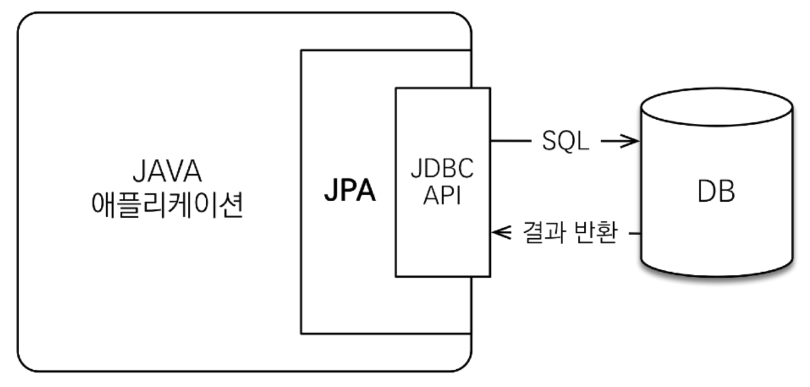
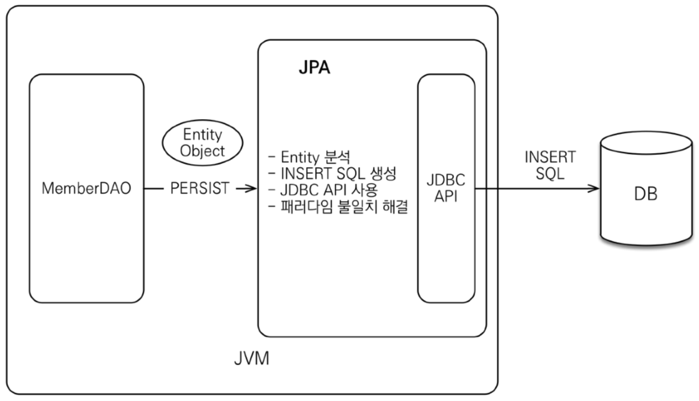
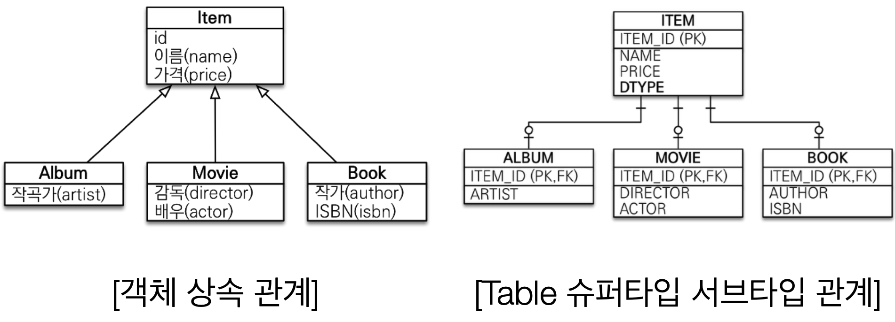

## JPA?
- Java Persistence API
- 자바 진영의 **ORM** 기술 표준

## ORM?
- Object-relational mapping(객체 관계 매핑)
- 객체는 객체대로 설계
- 관계형 데이터베이스는 관계형 데이터베이스대로 설계
- ORM 프레임워크가 중간에서 매핑
- 대중적인 언어에는 대부분 ORM 기술이 존재

### JPA는 애플리케이션과 JDBC 사이에서 동작


### JPA 동작 - 저장


### JPA 동작 - 조회


## JPA는 표준 명세
- JPA는 인터페이스 모음
- JPA 2.1 표준 명세를 구현한 3가지 구현체
- 하이버네이트, EclipseLink, DataNucleus

### JPA를 왜 사용해야 하는가?
- SQL 중심적인 개발에서 객체 중심으로 개발
- 생산성
- 유지보수
- 패러다임의 불일치 해결
- 성능
- 데이터 접근 추상화와 벤더 독립성
- 표준
---
- 생산성 - JPA와 CRUD
	• 저장: **jpa.persist**(member)
	• 조회: Member member = **jpa.find**(memberId)
	• 수정: **member.setName**(“변경할 이름”)
	• 삭제: **jpa.remove**(member)
- 유지보수 시
	- 필드 추가에 따라  SQL도 모두 변경해야 했음
	- 하지만 JPA는 객체에 필드만 추가하면 SQL은 JPA가 처리

### JPA와 패러다임의 불일치 해결
1. JPA와 상속
2. JPA와 연관관계
3. JPA와 객체 그래프 탐색
4. JPA와 비교하기

#### JPA와 상속


- 저장
	- 개발자가 할 일: jpa.persist(album);
	- 나머진 JPA가 처리
		- INSERT INTO ITEM ...
		- INSERT INTO ALBUM ...
- 조회
	- 개발자가 할 일: Album album = jpa.find(Album.class, albumId);
	- 나머진 JPA가 처리
		- `SELECT I.*, A.* FROM ITEM I JOIN ALBUM A ON I.ITEM_ID = A.ITEM_ID`
- JPA와 연관관계, 객체 그래프 탐색
	- 연관관계 저장
		- member.setTeam(team);
		- jpa.persist(member);
	- 객체 그래프 탐색
		- Member member = jpa.find(Member.class, memberId);
		- Team team = member.getTeam();
- 신뢰할 수 있는 엔티티, 계층
```java
class MemberService {
	...
	public void process() {
		Member member = memberDAO.find(memberId);
		member.getTeam(); // 자유로운 객체 그래프 탐색
		member.getOrder().getDelivery();
	}
}
```

- JPA와 비교하기
```java
String memberId = "100";
Member member1 = jpa.find(Member.class, memberId);
Member member2 = jpa.find(Member.class, memberId);
member1 == member2; //같다.
// 동일한 트랜잭션에서 조회한 엔티티는 같음을 보장
```

### JPA의 성능 최적화 기능
1. 1차 캐시와 동일성(identity) 보장
2. 트랜잭션을 지원하는 쓰기 지연 (transactional write-behind)
3. 지연 로딩(Lazy Loading)

#### 1차 캐시와 동일성 보장
1. 같은 트랜잭션 안에서는 같은 엔티티를 반환 - 약간의 조회 성능 향상
2. DB Isolation Level이 Read Commit이어도 애플리케이션에서 Repeatable Read 보장

```java
String memberId = "100";
Member m1 = jpa.find(Member.class, memberId); //SQL
Member m2 = jpa.find(Member.class, memberId); //캐시
println(m1 == m2) //true

// SQL 1번만 실행
```

#### 트랜잭션을 지원하는 쓰기 지연 - INSERT
1. 트랜잭션을 커밋할 때까지 INSERT SQL을 모음
2. JDBC BATCH SQL 기능을 사용해서 한번에 SQL 전송

```java
transaction.begin(); // [트랜잭션] 시작

em.persist(memberA);
em.persist(memberB);
em.persist(memberC);
//여기까지 INSERT SQL을 데이터베이스에 보내지 않는다.
//커밋하는 순간 데이터베이스에 INSERT SQL을 모아서 보낸다.
transaction.commit();// [트랜잭션] 커밋
```

#### 트랜잭션을 지원하는 쓰기 지연 - UPDATE
1. UPDATE, DELETE로 인한 로우(ROW)락 시간 최소화
2. 트랜잭션 커밋 시 UPDATE, DELETE SQL 실행하고, 바로 커밋

```java
transaction.begin(); // [트랜잭션] 시작
changeMember(memberA);
deleteMember(memberB);

비즈니스_로직_수행(); // 비즈니스 로직 수행 동안 DB 로우 락이 걸리지 않는다.

//커밋하는 순간 데이터베이스에 UPDATE, DELETE SQL을 보낸다.
transaction.commit(); // [트랜잭션] 커밋
```

#### 지연 로딩과 즉시 로딩
- 지연 로딩: 객체가 실제 사용될 때 로딩
- 즉시 로딩: JOIN SQL로 한번에 연관된 객체까지 미리 조회

개발 시 기본 지연 로딩으로 개발하다가, 성능 최적화 필요 시 즉시 로딩으로 간단하게 변경할 수 있다.

```java
// 지연 로딩
Member member = memberDAO.find(memberId); // -> SELECT * FROM MEMBER
Team team = member.getTeam();
String teamName = team.getName(); // -> SELECT * FROM TEAM

// 즉시 로딩
Member member = memberDAO.find(memberId); // -> SELECT M.*, T.* FROM MEMBER M JOIN TEAM ...
Team team = member.getTeam();
String teamName = team.getName();
```


__출처: 인프런 김영한 지식공유자님의 강의 - 스프링 DB 2편__