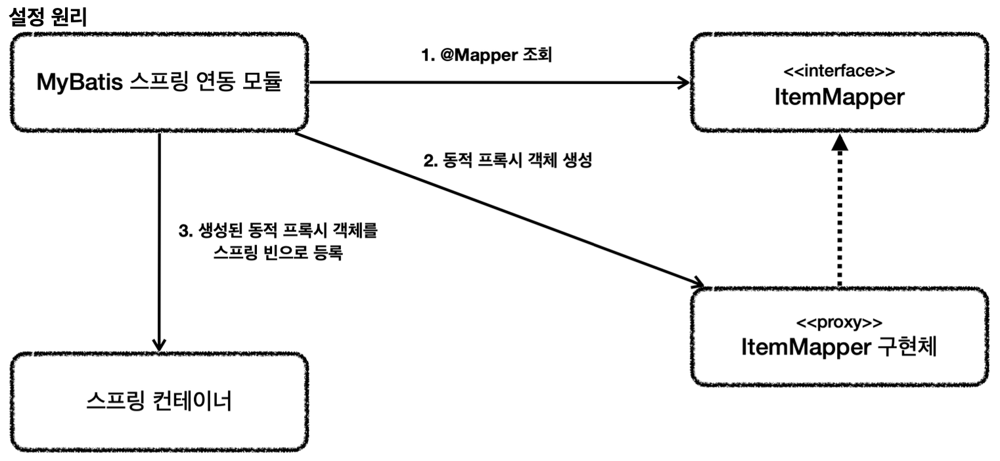

생각해보면 지금까지 진행한 내용 중 이상한 부분이 있다.
`ItemMapper` 매퍼 인터페이스의 구현체가 없는데 어떻게 동작한 것일까?

**ItemMapper 인터페이스**
```java
package hello.itemservice.repository.mybatis;  
  
import hello.itemservice.domain.Item;  
import hello.itemservice.repository.ItemSearchCond;  
import hello.itemservice.repository.ItemUpdateDto;  
import java.util.List;  
import java.util.Optional;  
import org.apache.ibatis.annotations.Mapper;  
import org.apache.ibatis.annotations.Param;  
  
@Mapper  
public interface ItemMapper {  
  void save(Item item);  
  void update(@Param("id") Long id, @Param("updateParam") ItemUpdateDto updateParam);  
  Optional<Item> findById(Long id);  
  List<Item> findAll(ItemSearchCond itemSearchCond);  
}
```

이 부분은 MyBatis 스프링 연동 모듈에서 자동으로 처리해주는데 다음과 같다.


1. 애플리케이션 로딩 시점에 MyBatis 스프링 연동 모듈은 `@Mapper`가 붙어있는 인터페이스를 조사한다.
2. 해당 인터페이스가 발견되면 동적 프록시 기술을 사용해서 `ItemMapper` 인터페이스의 구현체를 만든다.
3. 생성된 구현체를 스프링 빈으로 등록한다.

실제 동적 프록시 기술이 사용되었는지 간단히 확인해보자.

**MyBatisItemRepository - 로그 추가**
```java
@Slf4j  
@Repository  
@RequiredArgsConstructor  
public class MyBatisItemRepository implements ItemRepository {  
  
  private final ItemMapper itemMapper;  
  
  @Override  
  public Item save(Item item) {  
    log.info("itemMapper class={}", itemMapper.getClass());  
    itemMapper.save(item);  
    return item;  
  }  
}
```

실행해서 주입 받은 `ItemMapper` 의 클래스를 출력해보자.
**실행 결과**
```
itemMapper class=class com.sun.proxy.$Proxy57
```
출력해보면 JDK 동적 프록시가 적용된 것을 확인할 수 있다.

**매퍼 구현체**  
- 마이바티스 스프링 연동 모듈이 만들어주는 `ItemMapper`의 구현체 덕분에 인터페이스만으로 편리하게 XML의 데이터를 찾아서 호출할 수 있다.
- 원래 마이바티스를 사용하려면 더 번잡한 코드를 거쳐야 하는데, 이런 부분을 인터페이스 하나로 매우 깔끔하고 편리하게 사용할 수 있다.
- 매퍼 구현체는 예외 변환까지 처리해준다. MyBatis에서 발생한 예외를 스프링 예외 추상화인 `DataAccessException`에 맞게 변환해서 반환해 준다.
	- JdbcTemplate이 제공하는 예외 변환 기능을 여기서도 제공한다고 이해하면 된다.
	- 따로 설정하지 않아도, Spring에서 제공하는 DataAccessException에 맞게 변환해서 반환해 준다.

**정리**
- 매퍼 구현체 덕분에 마이바티스를 스프링에 편리하게 통합해서 사용할 수 있다.
- 매퍼 구현체를 사용하면 스프링 예외 추상화도 함께 적용된다.
- 마이바티스 스프링 연동 모듈이 많은 부분을 자동으로 설정해주는데, 데이터베이스 커넥션, 트랜잭션과 관련된 기능도 마이바티스와 함께 연동하고, 동기화해준다.

> **참고**
> 마이바티스 스프링 연동 모듈이 자동으로 등록해주는 부분은 `MybatisAutoConfiguration` 클래스를 참고하자.

__출처: 인프런 김영한 지식공유자님의 강의 - 스프링 DB 2편__